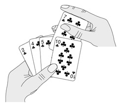
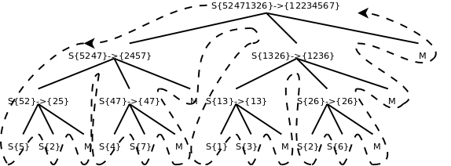
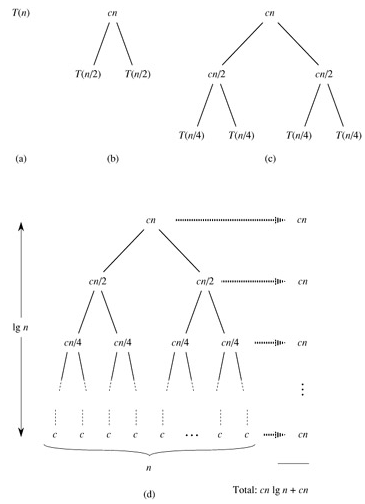

# 第 11 章 排序与查找

## 1. 算法的概念

算法（Algorithm）是将一组输入转化成一组输出的一系列计算步骤，其中每个步骤必须能在有限时间内完成。比如[第 5 章第 3 节「递归」习题 1]() 中的 Euclid 算法，输入是两个正整数，输出是它们的最大公约数，计算步骤是取模、比较等操作，这个算法一定能在有限的步骤和时间内完成（想一想为什么？）。再比如将一组数从小到大排序，输入是一组原始数据，输出是排序之后的数据，计算步骤包括比较、移动数据等操作。

算法是用来解决一类计算问题的，注意是一类问题，而不是一个特定的问题。例如，一个排序算法应该能对任意一组数据进行排序，而不是仅对 `int a[] = { 1, 3, 4, 2, 6, 5 };` 这样一组数据排序，如果只需要对这一组数据排序可以写这样一个函数来做：

```c
void sort(void)
{
	a[0] = 1;
	a[1] = 2;
	a[2] = 3;
	a[3] = 4;
	a[4] = 5;
	a[5] = 6;
}
```

这显然不叫算法，因为不具有通用性。由于算法是用来解决一类问题的，它必须能够正确地解决这一类问题中的任何一个实例，这个算法才是正确的。对于排序算法，任意输入一组数据，它必须都能输出正确的排序结果，这个排序算法才是正确的。不正确的算法有两种可能，一是对于该问题的某些输入，该算法会无限计算下去，不会终止，二是对于该问题的某些输入，该算法终止时输出的是错误的结果。有时候不正确的算法也是有用的，如果对于某个问题寻求正确的算法很困难，而某个不正确的算法可以在有限时间内终止，并且能把误差控制在一定范围内，那么这样的算法也是有实际意义的。例如有时候寻找最优解的开销很大，往往会选择能给出次优解的算法。

本章介绍几种典型的排序和查找算法，并围绕这几种算法做时间复杂度分析。学完本章之后如果想进一步学习，可以参考一些全面系统地介绍算法的书，例如 **TAOCP** 和**算法导论**。

## 2. 插入排序

插入排序算法类似于玩扑克时抓牌的过程，玩家每拿到一张牌都要插入到手中已有的牌里，使之从小到大排好序。例如（该图出自算法导论）：

图 11.1. 扑克牌的插入排序



也许你没有意识到，但其实你的思考过程是这样的：现在抓到一张 7，把它和手里的牌从右到左依次比较，7 比 10 小，应该再往左插，7 比 5 大，好，就插这里。为什么比较了 10 和 5 就可以确定 7 的位置？为什么不用再比较左边的 4 和 2 呢？因为这里有一个重要的前提：手里的牌已经是排好序的。现在我插了 7 之后，手里的牌仍然是排好序的，下次再抓到的牌还可以用这个方法插入。

编程对一个数组进行插入排序也是同样道理，但和插入扑克牌有一点不同，不可能在两个相邻的存储单元之间再插入一个单元，因此要将插入点之后的数据依次往后移动一个单元。排序算法如下：

例 11.1. 插入排序

```c
#include <stdio.h>

#define LEN 5
int a[LEN] = { 10, 5, 2, 4, 7 };

void insertion_sort(void)
{
	int i, j, key;
	for (j = 1; j < LEN; j++) {
		printf("%d, %d, %d, %d, %d\n",
		       a[0], a[1], a[2], a[3], a[4]);
		key = a[j];
		i = j - 1;
		while (i >= 0 && a[i] > key) {
			a[i+1] = a[i];
			i--;
		}
		a[i+1] = key;
	}
	printf("%d, %d, %d, %d, %d\n",
	       a[0], a[1], a[2], a[3], a[4]);
}

int main(void)
{
	insertion_sort();
	return 0;
}
```

为了更清楚地观察排序过程，我们在每次循环开头插了打印语句，在排序结束后也插了打印语句。程序运行结果是：

```bash
10, 5, 2, 4, 7
5, 10, 2, 4, 7
2, 5, 10, 4, 7
2, 4, 5, 10, 7
2, 4, 5, 7, 10
```

如何严格证明这个算法是正确的？换句话说，只要反复执行该算法的 `for` 循环体，执行 `LEN-1` 次，就一定能把数组 `a` 排好序，而不管数组 `a` 的原始数据是什么，如何证明这一点呢？我们可以借助 Loop Invariant 的概念和数学归纳法来理解循环结构的算法，假如某个判断条件满足以下三条准则，它就称为 Loop Invariant：

1. 第一次执行循环体之前该判断条件为真。
2. 如果「第 N-1 次循环之后（或者说第 N 次循环之前）该判断条件为真」这个前提可以成立，那么就有办法证明第 N 次循环之后该判断条件仍为真。
3. 如果在所有循环结束后该判断条件为真，那么就有办法证明该算法正确地解决了问题。

只要我们找到这个 Loop Invariant，就可以证明一个循环结构的算法是正确的。上述插入排序算法的 Loop Invariant 是这样的判断条件：**第 j 次循环之前，子序列 a[0..j-1] 是排好序的**。在上面的打印结果中，我把子序列 a[0..j-1] 加粗表示。下面我们验证一下 Loop Invariant 的三条准则：

1. 第一次执行循环之前，`j=1`，子序列 a[0..j-1] 只有一个元素 `a[0]`，只有一个元素的序列显然是排好序的。
2. 第 `j` 次循环之前，如果「子序列 a[0..j-1] 是排好序的」这个前提成立，现在要把 `key=a[j]` 插进去，按照该算法的步骤，把 `a[j-1]`、`a[j-2]`、`a[j-3]` 等等比 `key` 大的元素都依次往后移一个，直到找到合适的位置给 `key` 插入，就能证明循环结束时子序列 a[0..j] 是排好序的。就像插扑克牌一样，「手中已有的牌是排好序的」这个前提很重要，如果没有这个前提，就不能证明再插一张牌之后也是排好序的。
3. 当循环结束时，`j=LEN`，如果「子序列a[0..j-1]是排好序的」这个前提成立，那就是说 a[0..LEN-1] 是排好序的，也就是说整个数组 `a` 的 `LEN` 个元素都排好序了。

可见，有了这三条，就可以用数学归纳法证明这个循环是正确的。这和[第 5 章第 3 节「递归」]()证明递归程序正确性的思想是一致的，这里的第一条就相当于递归的 Base Case，第二条就相当于递归的递推关系。这再次说明了递归和循环是等价的。

## 3. 算法的时间复杂度分析

解决同一个问题可以有很多种算法，比较评价算法的好坏，一个重要的标准就是算法的时间复杂度。现在研究一下插入排序算法的执行时间，按照习惯，输入长度 `LEN` 以下用 n 表示。设循环中各条语句的执行时间分别是 c1、c2、c3、c4、c5 这样五个常数<sup>[23]</sup>：

> <sup>[23]</sup> 受内存管理机制的影响，指令的执行时间不一定是常数，但执行时间的上界（Upper Bound）肯定是常数，我们这里假设语句的执行时间是常数只是一个粗略估计。

```c
void insertion_sort(void)			执行时间
{
	int i, j, key;
	for (j = 1; j < LEN; j++) {
		key = a[j];										c1
		i = j - 1;										c2
		while (i >= 0 && a[i] > key) {
			a[i+1] = a[i];							c3
			i--;												c4
		}
		a[i+1] = key;									c5
	}
}
```

显然外层 `for` 循环的执行次数是 n-1 次，假设内层的 `while` 循环执行 m 次，则总的执行时间粗略估计是 `(n-1)*(c1+c2+c5+m*(c3+c4))`。当然，`for` 和 `while` 后面 `()` 括号中的赋值和条件判断的执行也需要时间，而我没有设一个常数来表示，这不影响我们的粗略估计。

这里有一个问题，m 不是个常数，也不取决于输入长度 n，而是取决于具体的输入数据。在最好情况下，数组 `a` 的原始数据已经排好序了，`while` 循环一次也不执行，总的执行时间是 `(c1+c2+c5)*n-(c1+c2+c5)`，可以表示成 an+b 的形式，是 n 的线性函数（Linear Function）。那么在最坏情况（Worst Case）下又如何呢？所谓最坏情况是指数组 `a` 的原始数据正好是从大到小排好序的，请读者想一想为什么这是最坏情况，然后把上式中的 m 替换掉算一下执行时间是多少。

数组 `a` 的原始数据属于最好和最坏情况的都比较少见，如果原始数据是随机的，可称为平均情况（Average Case）。如果原始数据是随机的，那么每次循环将已排序的子序列 a[1..j-1] 与新插入的元素 `key` 相比较，子序列中平均都有一半的元素比 `key` 大而另一半比 `key` 小，请读者把上式中的 m 替换掉算一下执行时间是多少。最后的结论应该是：在最坏情况和平均情况下，总的执行时间都可以表示成 an<sup>2</sup>+bn+c 的形式，是 n 的二次函数（Quadratic Function）。

在分析算法的时间复杂度时，我们更关心最坏情况而不是最好情况，理由如下：

1. 最坏情况给出了算法执行时间的上界，我们可以确信，无论给什么输入，算法的执行时间都不会超过这个上界，这样为比较和分析提供了便利。
2. 对于某些算法，最坏情况是最常发生的情况，例如在数据库中查找某个信息的算法，最坏情况就是数据库中根本不存在该信息，都找遍了也没有，而某些应用场合经常要查找一个信息在数据库中存在不存在。
3. 虽然最坏情况是一种悲观估计，但是对于很多问题，平均情况和最坏情况的时间复杂度差不多，比如插入排序这个例子，平均情况和最坏情况的时间复杂度都是输入长度 n 的二次函数。

比较两个多项式 a1n+b1 和 a2n<sup>2</sup>+b2n+c2 的值（n 取正整数）可以得出结论：n 的最高次指数是最主要的决定因素，常数项、低次幂项和系数都是次要的。比如 100n+1 和 n<sup>2</sup>+1，虽然后者的系数小，当 n 较小时前者的值较大，但是当 n>100 时，后者的值就远远大于前者了。如果同一个问题可以用两种算法解决，其中一种算法的时间复杂度为线性函数，另一种算法的时间复杂度为二次函数，当问题的输入长度 n 足够大时，前者明显优于后者。因此我们可以用一种更粗略的方式表示算法的时间复杂度，把系数和低次幂项都省去，线性函数记作 Θ(n)，二次函数记作 Θ(n<sup>2</sup>)。

Θ(g(n)) 表示和 g(n) 同一量级的一类函数，例如所有的二次函数 f(n) 都和 g(n)=n<sup>2</sup> 属于同一量级，都可以用 Θ(n<sup>2</sup>) 来表示，甚至有些不是二次函数的也和 n<sup>2</sup> 属于同一量级，例如 2n<sup>2</sup>+3lgn。「同一量级」这个概念可以用下图来说明（该图出自算法导论）：

图 11.2. Θ-notation


如果可以找到两个正的常数 c1 和 c2，使得 n 足够大的时候（也就是 n≥n0 的时候）f(n) 总是夹在c1g(n) 和 c2g(n) 之间，就说 f(n) 和 g(n) 是同一量级的，f(n) 就可以用 Θ(g(n)) 来表示。

以二次函数为例，比如 1/2n<sup>2</sup>-3n，要证明它是属于 Θ(n<sup>2</sup>) 这个集合的，我们必须确定 c1、c2 和 n0，这些常数不随 n 改变，并且当 n≥n0 以后，c1n2≤1/2n2-3n≤c2n2 总是成立的。为此我们从不等式的每一边都除以 n<sup>2</sup>，得到 c1≤1/2-3/n≤c2。见下图：

图 11.3. 1/2-3/n


这样就很容易看出来，无论 n 取多少，该函数一定小于 1/2，因此 c2=1/2，当 n=6 时函数值为 0，n>6 时该函数都大于 0，可以取 n0=7，c1=1/14，这样当 n≥n0 时都有 1/2-3/n≥c1。通过这个证明过程可以得出结论，当 n 足够大时任何 an<sup>2</sup>+bn+c 都夹在 c1n<sup>2</sup> 和 c2n<sup>2</sup> 之间，相对于 n<sup>2</sup> 项来说 bn+c 的影响可以忽略，a 可以通过选取合适的 c1、c2 来补偿。

几种常见的时间复杂度函数按数量级从小到大的顺序依次是：Θ(lgn)，Θ(sqrt(n))，Θ(n)，Θ(nlgn)，Θ(n2)，Θ(n3)，Θ(2n)，Θ(n!)。其中，lg<sub>n</sub> 通常表示以 10 为底 n 的对数，但是对于 Θ-notation 来说，Θ(lgn) 和 Θ(log<sub>2</sub>n) 并无区别（想一想这是为什么），在算法分析中 lg<sub>n</sub> 通常表示以 2 为底 n 的对数。可是什么算法的时间复杂度里会出现 lg<sub>n</sub> 呢？回顾插入排序的时间复杂度分析，无非是循环体的执行时间乘以循环次数，只有加和乘运算，怎么会出来 lg 呢？下一节归并排序的时间复杂度里面就有 lg，请读者留心 lg 运算是从哪出来的。

除了 Θ-notation 之外，表示算法的时间复杂度常用的还有一种 Big-O notation。我们知道插入排序在最坏情况和平均情况下时间复杂度是 Θ(n<sup>2</sup>)，在最好情况下是 Θ(n)，数量级比 Θ(n<sup>2</sup>)要小，那么总结起来在各种情况下插入排序的时间复杂度是 O(n<sup>2</sup>)。Θ 的含义和「等于」类似，而大 O 的含义和「小于等于」类似。

## 4. 归并排序

插入排序算法采取增量式（Incremental）的策略解决问题，每次添一个元素到已排序的子序列中，逐渐将整个数组排序完毕，它的时间复杂度是 O(n2)。下面介绍另一种典型的排序算法——归并排序，它采取分而治之（Divide-and-Conquer）的策略，时间复杂度是 Θ(nlgn)。归并排序的步骤如下：

1. Divide: 把长度为n的输入序列分成两个长度为 n/2 的子序列。
2. Conquer: 对这两个子序列分别采用归并排序。
3. Combine: 将两个排序好的子序列合并成一个最终的排序序列。

在描述归并排序的步骤时又调用了归并排序本身，可见这是一个递归的过程。

例 11.2. 归并排序

```c
#include <stdio.h>

#define LEN 8
int a[LEN] = { 5, 2, 4, 7, 1, 3, 2, 6 };

void merge(int start, int mid, int end)
{
	int n1 = mid - start + 1;
	int n2 = end - mid;
	int left[n1], right[n2];
	int i, j, k;

	for (i = 0; i < n1; i++) /* left holds a[start..mid] */
		left[i] = a[start+i];
	for (j = 0; j < n2; j++) /* right holds a[mid+1..end] */
		right[j] = a[mid+1+j];

	i = j = 0;
	k = start;
	while (i < n1 && j < n2)
		if (left[i] < right[j])
			a[k++] = left[i++];
		else
			a[k++] = right[j++];

	while (i < n1) /* left[] is not exhausted */
		a[k++] = left[i++];
	while (j < n2) /* right[] is not exhausted */
		a[k++] = right[j++];
}

void sort(int start, int end)
{
	int mid;
	if (start < end) {
		mid = (start + end) / 2;
		printf("sort (%d-%d, %d-%d) %d %d %d %d %d %d %d %d\n", 
		       start, mid, mid+1, end, 
		       a[0], a[1], a[2], a[3], a[4], a[5], a[6], a[7]);
		sort(start, mid);
		sort(mid+1, end);
		merge(start, mid, end);
		printf("merge (%d-%d, %d-%d) to %d %d %d %d %d %d %d %d\n", 
		       start, mid, mid+1, end, 
		       a[0], a[1], a[2], a[3], a[4], a[5], a[6], a[7]);
	}
}

int main(void)
{
	sort(0, LEN-1);
	return 0;
}
```

执行结果是：

```bash
sort (0-3, 4-7) 5 2 4 7 1 3 2 6
sort (0-1, 2-3) 5 2 4 7 1 3 2 6
sort (0-0, 1-1) 5 2 4 7 1 3 2 6
merge (0-0, 1-1) to 2 5 4 7 1 3 2 6
sort (2-2, 3-3) 2 5 4 7 1 3 2 6
merge (2-2, 3-3) to 2 5 4 7 1 3 2 6
merge 0-1, 2-3) to 2 4 5 7 1 3 2 6
sort (4-5, 6-7) 2 4 5 7 1 3 2 6
sort (4-4, 5-5) 2 4 5 7 1 3 2 6
merge (4-4, 5-5) to 2 4 5 7 1 3 2 6
sort (6-6, 7-7) 2 4 5 7 1 3 2 6
merge (6-6, 7-7) to 2 4 5 7 1 3 2 6
merge (4-5, 6-7) to 2 4 5 7 1 2 3 6
merge (0-3, 4-7) to 1 2 2 3 4 5 6 7
```

`sort` 函数把 a[start..end] 平均分成两个子序列，分别是 a[start..mid] 和 a[mid+1..end]，对这两个子序列分别递归调用 `sort` 函数进行排序，然后调用 `merge` 函数将排好序的两个子序列合并起来，由于两个子序列都已经排好序了，合并的过程很简单，每次循环取两个子序列中最小的元素进行比较，将较小的元素取出放到最终的排序序列中，如果其中一个子序列的元素已取完，就把另一个子序列剩下的元素都放到最终的排序序列中。为了便于理解程序，我在 `sort` 函数开头和结尾插了打印语句，可以看出调用过程是这样的：

图 11.4. 归并排序调用过程



图中 S 表示 `sort` 函数，M 表示 `merge` 函数，整个控制流程沿虚线所示的方向调用和返回。由于 `sort` 函数递归调用了自己两次，所以各函数之间的调用关系呈树状结构。画这个图只是为了清楚地展现归并排序的过程，读者在理解递归函数时一定不要全部展开来看，而是要抓住 Base Case 和递推关系来理解。我们分析一下归并排序的时间复杂度，以下分析出自算法导论。

首先分析 `merge` 函数的时间复杂度。在 `merge` 函数中演示了 C99 的新特性——可变长数组，当然也可以避免使用这一特性，比如把 `left` 和 `right` 都按最大长度 `LEN` 分配。不管用哪种办法，定义数组并分配存储空间的执行时间都可以看作常数，与数组的长度无关，常数用 Θ-notation 记作 Θ(1)。设子序列 a[start..mid] 的长度为 `n1`，子序列 [mid+1..end] 的长度为 `n2`，a[start..end] 的总长度为 n=n1+n2，则前两个 `for` 循环的执行时间是 Θ(n1+n2)，也就是 Θ(n)，后面三个 `for` 循环合在一起看，每走一次循环就会在最终的排序序列中确定一个元素，最终的排序序列共有 n 个元素，所以执行时间也是 Θ(n)。两个 Θ(n) 再加上若干常数项，`merge` 函数总的执行时间仍是 Θ(n)，其中 n=end-start+1。

然后分析 `sort` 函数的时间复杂度，当输入长度 n=1，也就是 `start==end` 时，`if` 条件不成立，执行时间为常数 Θ(1)，当输入长度 n>1 时：

总的执行时间 = 2 × 输入长度为 n/2 的 `sort` 函数的执行时间 + `merge` 函数的执行时间 Θ(n)

设输入长度为 n 的 `sort` 函数的执行时间为 T(n)，综上所述：


这是一个递推公式（Recurrence），我们需要消去等号右侧的 T(n)，把 T(n) 写成 n 的函数。其实符合一定条件的 Recurrence 的展开有数学公式可以套，这里我们略去严格的数学证明，只是从直观上看一下这个递推公式的结果。当 n=1 时可以设 T(1)=c1，当 n>1 时可以设 T(n)=2T(n/2)+c2n，我们取 c1 和 c2 中较大的一个设为 c，把原来的公式改为：


这样计算出的结果应该是 T(n) 的上界。下面我们把 T(n/2) 展开成 2T(n/4)+cn/2（下图中的 (c)），然后再把 T(n/4) 进一步展开，直到最后全部变成 T(1)=c（下图中的 (d)）：



把图 (d) 中所有的项加起来就是总的执行时间。这是一个树状结构，每一层的和都是 cn，共有 lgn+1 层，因此总的执行时间是 cnlgn+cn，相比 nlgn 来说，cn 项可以忽略，因此 T(n) 的上界是 Θ(nlgn)。

如果先前取 c1 和 c2 中较小的一个设为 c，计算出的结果应该是 T(n) 的下界，然而推导过程一样，结果也是 Θ(nlgn)。既然 T(n) 的上下界都是 Θ(nlgn)，显然 T(n) 就是 Θ(nlgn)。

和插入排序的平均情况相比归并排序更快一些，虽然 `merge` 函数的步骤较多，引入了较大的常数、系数和低次项，但是对于较大的输入长度 n，这些都不是主要因素，归并排序的时间复杂度是 Θ(nlgn)，而插入排序的平均情况是 Θ(n2)，这就决定了归并排序是更快的算法。但是不是任何情况下归并排序都优于插入排序呢？哪些情况适用插入排序而不适用归并排序？留给读者思考。

### 习题

1、快速排序是另外一种采用分而治之策略的排序算法，在平均情况下的时间复杂度也是 Θ(nlgn)，但比归并排序有更小的时间常数。它的基本思想是这样的：

```c
int partition(int start, int end)
{
	从 a[start..end] 中选取一个 pivot 元素（比如选 a[start] 为 pivot）;
	在一个循环中移动 a[start..end] 的数据，将 a[start..end] 分成两半，
	使 a[start..mid-1] 比 pivot 元素小，a[mid+1..end] 比 pivot 元素大，而 a[mid] 就是 pivot 元素;
	return mid;
}

void quicksort(int start, int end)
{
	int mid;
	if (end > start) {
		mid = partition(start, end);
		quicksort(start, mid-1);
		quicksort(mid+1, end);
	}
}
```

请补完 `partition` 函数，这个函数有多种写法，请选择时间常数尽可能小的实现方法。想想快速排序在最好和最坏情况下的时间复杂度是多少？快速排序在平均情况下的时间复杂度分析起来比较复杂，有兴趣的读者可以参考算法导论。

## 5. 线性查找

有些查找问题要用时间复杂度为 O(n) 的算法来解决。例如写一个 `indexof` 函数，从任意输入字符串中找出某个字母的位置并返回这个位置，如果找不到就返回 `-1`：

例 11.3. 线性查找

```c
#include <stdio.h>

char a[]="hello world";

int indexof(char letter)
{
	int i = 0;
	while (a[i] != '\0') {
		if (a[i] == letter)
			return i;
		i++;
	}
	return -1;
}

int main(void)
{
	printf("%d %d\n", indexof('o'), indexof('z'));
	return 0;
}
```

这个实现是最直观和最容易想到的，但它是不是最快的算法呢？我们知道插入排序也比归并排序更容易想到，但通常不如归并排序快。那么现在这个问题——给定一个随机排列的序列，找出其中某个元素的位置——有没有比 O(n) 更快的算法？比如 O(lgn)？请读者思考一下。

### 习题

1、实现一个算法，在一组随机排列的数中找出最小的一个。你能想到的最直观的算法一定是 Θ(n) 的，想想有没有比 Θ(n) 更快的算法？

2、在一组随机排列的数中找出第二小的，这个问题比上一个稍复杂，你能不能想出 Θ(n) 的算法？

3、进一步泛化，在一组随机排列的数中找出第 k 小的，这个元素称为 k-th Order Statistic。能想到的最直观的算法肯定是先把这些数排序然后取第 k 个，时间复杂度和排序算法相同，可以是 Θ(nlgn)。这个问题虽然比前两个问题复杂，但它也有平均情况下时间复杂度是 Θ(n) 的算法，将[本章上一节习题 1]() 的快速排序算法稍加修改就可以解决这个问题：

```c
/* 从 start 到 end 之间找出第 k 小的元素 */
int order_statistic(int start, int end, int k)
{
	用 partition 函数把序列分成两半，中间的 pivot 元素是序列中的第 i 个;
	if (k == i)
		返回找到的元素;
	else if (k > i)
		从后半部分找出第k-i小的元素并返回;
	else
		从前半部分找出第k小的元素并返回;
}
```

请编程实现这个算法。

## 6. 折半查找

如果不是从一组随机的序列里查找，而是从一组排好序的序列里找出某个元素的位置，则可以有更快的算法：

例 11.4. 折半查找

```c
#include <stdio.h>

#define LEN 8
int a[LEN] = { 1, 2, 2, 2, 5, 6, 8, 9 };

int binarysearch(int number)
{
	int mid, start = 0, end = LEN - 1;

	while (start <= end) {
		mid = (start + end) / 2;
		if (a[mid] < number)
			start = mid + 1;
		else if (a[mid] > number)
			end = mid - 1;
		else
			return mid;
	}
	return -1;
}

int main(void)
{
	printf("%d\n", binarysearch(5));
	return 0;
}
```

由于这个序列已经从小到大排好序了，每次取中间的元素和待查找的元素比较，如果中间的元素比待查找的元素小，就说明「如果待查找的元素存在，一定位于序列的后半部分」，这样可以把搜索范围缩小到后半部分，然后再次使用这种算法迭代。这种「每次将搜索范围缩小一半」的思想称为折半查找（Binary Search）。思考一下，这个算法的时间复杂度是多少？

这个算法的思想很简单，不是吗？可是编程珠玑上说作者在课堂上讲完这个算法的思想然后让学生写程序，有 90% 的人写出的程序中有各种各样的 Bug，读者不信的话可以不看书自己写一遍试试。这个算法容易出错的地方很多，比如 `mid = (start + end) / 2;` 这一句，在数学概念上其实是 `mid = ⌊(start + end) / 2⌋`，还有 `start = mid + 1;` 和 `end = mid - 1;`，如果前者写成了 `start = mid;` 或后者写成了 `end = mid;` 那么很可能会导致死循环（想一想什么情况下会死循环）。

怎样才能保证程序的正确性呢？在[本章第 2 节「插入排序」]()我们讲过借助 Loop Invariant 证明循环的正确性，`binarysearch` 这个函数的主体也是一个循环，它的 Loop Invariant 可以这样描述：**待查找的元素number如果存在于数组a之中，那么一定存在于 a[start..end] 这个范围之间，换句话说，在这个范围之外的数组 a 的元素中一定不存在 number 这个元素**。以下为了书写方便，我们把这句话表示成 `mustbe(start, end, number)`。可以一边看算法一边做推理：

```c
int binarysearch(int number)
{
	int mid, start = 0, end = LEN - 1;

	/* 假定a是排好序的 */
	/* mustbe(start, end, number)，因为a[start..end]就是整个数组a[0..LEN-1] */
	while (start <= end) {
	/* mustbe(start, end, number)，因为一开始进入循环时是正确的，每次循环也都维护了这个条件 */
		mid = (start + end) / 2;
		if (a[mid] < number)
			/* 既然a是排好序的，a[start..mid]应该都比number小，所以mustbe(mid+1, end, number) */
			start = mid + 1;
			/* 维护了mustbe(start, end, number) */
		else if (a[mid] > number)
			/* 既然a是排好序的，a[mid..end]应该都比number大，所以mustbe(start, mid-1, number) */
			end = mid - 1;
			/* 维护了mustbe(start, end, number) */
		else
			/* a[mid] == number，说明找到了 */
			return mid;
	}
	/* 
	 * mustbe(start, end, number)一直被循环维护着，到这里应该仍然成立，在a[start..end]范围之外一定不存在number，
	 * 但现在a[start..end]是空序列，在这个范围之外的正是整个数组a，因此整个数组a中都不存在number
	 */
	return -1;
}
```

注意这个算法有一个非常重要的前提——`a` 是排好序的。缺了这个前提，「如果 `a[mid] < number`，那么 a[start..mid] 应该都比 `number` 小」这一步推理就不能成立，这个函数就不能正确地完成查找。从更普遍的意义上说，函数的调用者（Caller）和函数的实现者（Callee，被调用者）之间订立了一个契约（Contract），在调用函数之前，Caller 要为 Callee 提供某些条件，比如确保 `a` 是排好序的，确保 a[start..end] 都是有效的数组元素而没有访问越界，这称为 Precondition，然后 Callee 对一些 Invariant 进行维护（Maintenance），这些 Invariant 保证了 Callee 在函数返回时能够对 Caller 尽到某些义务，比如确保「如果 `number` 在数组 `a` 中存在，一定能找出来并返回它的位置，如果 `number` 在数组 `a` 中不存在，一定能返回 `-1`」，这称为 Postcondition。如果每个函数的文档都非常清楚地记录了 Precondition、Maintenance 和 Postcondition 是什么，那么每个函数都可以独立编写和测试，整个系统就会易于维护。这种编程思想是由 Eiffel 语言的设计者 Bertrand  Meyer 提出来的，称为 Design by Contract（DbC）。

测试一个函数是否正确需要把 Precondition、Maintenance 和 Postcondition 这三方面都测试到，比如 `binarysearch` 这个函数，即使它写得非常正确，既维护了 Invariant 也保证了 Postcondition，如果调用它的 Caller 没有保证 Precondition，最后的结果也还是错的。我们编写几个测试用的 Predicate 函数，然后把相关的测试插入到 `binarysearch` 函数中：

例 11.5. 带有测试代码的折半查找

```c
#include <stdio.h>
#include <assert.h>

#define LEN 8
int a[LEN] = { 1, 2, 2, 2, 5, 6, 8, 9 };

int is_sorted(void)
{
	int i;
	for (i = 1; i < LEN; i++)
		if (a[i-1] > a[i])
			return 0;
	return 1;
}

int mustbe(int start, int end, int number)
{
	int i;
	for (i = 0; i < start; i++)
		if (a[i] == number)
			return 0;
	for (i = end+1; i < LEN; i++)
		if (a[i] == number)
			return 0;
	return 1;
}

int contains(int n)
{
	int i;
	for (i = 0; i < LEN; i++)
		if (a[i] == n)
			return 1;
	return 0;
}

int binarysearch(int number)
{
	int mid, start = 0, end = LEN - 1;

	assert(is_sorted()); /* Precondition */
	while (start <= end) {
		assert(mustbe(start, end, number)); /* Maintenance */
		mid = (start + end) / 2;
		if (a[mid] < number)
			start = mid + 1;
		else if (a[mid] > number)
			end = mid - 1;
		else {
			assert(mid >= start && mid <= end
			       && a[mid] == number) /* Postcondition 1 */
			return mid;
		}
	}
	assert(!contains(number)); /* Postcondition 2 */
	return -1;
}

int main(void)
{
	printf("%d\n", binarysearch(5));
	return 0;
}
```

`assert` 是头文件 `assert.h` 中的一个宏定义，执行到 `assert(is_sorted())` 这句时，如果 `is_sorted()` 返回值为真，则当什么事都没发生过，继续往下执行，如果 `is_sorted()` 返回值为假（例如把数组的排列顺序改一改），则报错退出程序：

```bash
main: main.c:33: binarysearch: Assertion `is_sorted()' failed.
Aborted
```

在代码中适当的地方使用断言（Assertion）可以有效地帮助我们测试程序。也许有人会问：我们用几个测试函数来测试 `binarysearch`，那么这几个测试函数又用什么来测试呢？在实际工作中我们要测试的代码绝不会像 `binarysearch` 这么简单，而我们编写的测试函数往往都很简单，比较容易保证正确性，也就是用简单的、不容易出错的代码去测试复杂的、容易出错的代码。

测试代码只在开发和调试时有用，如果正式发布（Release）的软件也要运行这些测试代码就会严重影响性能了，如果在包含 `assert.h` 之前定义一个 `NDEBUG` 宏（表示 No Debug），就可以禁用 `assert.h` 中的 `assert` 宏定义，这样代码中的所有 `assert` 测试都不起作用了：

```c
#define NDEBUG
#include <stdio.h>
#include <assert.h>
...
```

注意 `NDEBUG` 和我们以前使用的宏定义有点不同，例如 `#define N 20` 将 `N` 定义为 20，在预处理时把代码中所有的标识符 `N` 替换成 20，而 `#define NDEBUG` 把 `NDEBUG` 定义为空，在预处理时把代码中所有的标识符 `NDEBUG` 替换成空。这样的宏定义主要是为了用 `#ifdef` 等预处理指示测试它定义过没有，而不是为了做替换，所以定义成什么值都无所谓，一般定义成空就足够了。

还有另一种办法，不必修改源文件，在编译命令行加上选项 `-DNDEBUG` 就相当于在源文件开头定义了 `NDEBUG`宏。宏定义和预处理到[第 21 章「预处理」]()再详细解释，在[第 21 章第 4 节「其它预处理特性」]()将给出 `assert.h` 一种实现。

### 习题

1、本节的折半查找算法有一个特点：如果待查找的元素在数组中有多个则返回其中任意一个，以本节定义的数组 `int a[8] = { 1, 2, 2, 2, 5, 6, 8, 9 };` 为例，如果调用 `binarysearch(2)` 则返回 3，即 `a[3]`，而有些场合下要求这样的查找返回 `a[1]`，也就是说，如果待查找的元素在数组中有多个则返回第一个。请修改折半查找算法实现这一特性。

2、编写一个函数 `double mysqrt(double y);` 求 `y` 的正平方根，参数 `y` 是正实数。我们用折半查找来找这个平方根，在从 0 到 `y` 之间必定有一个取值是 `y` 的平方根，如果我们查找的数 `x` 比 `y` 的平方根小，则 x2<y，如果我们查找的数 `x` 比 `y` 的平方根大，则 x2>y，我们可以据此缩小查找范围，当我们查找的数足够准确时（比如满足 |x2-y|<0.001），就可以认为找到了 `y` 的平方根。思考一下这个算法需要迭代多少次？迭代次数的多少由什么因素决定？

3、编写一个函数 `double mypow(double x, int n);` 求 `x` 的 `n` 次方，参数 `n` 是正整数。最简单的算法是：

```c
double product = 1;
for (i = 0; i < n; i++)
	product *= x;
```

这个算法的时间复杂度是 Θ(n)。其实有更好的办法，比如 `mypow(x, 8)`，第一次循环算出 x·x=x2，第二次循环算出 x2·x2=x4，第三次循环算出 x4·x4=x8。这样只需要三次循环，时间复杂度是 Θ(lgn)。思考一下如果 `n` 不是 2 的整数次幂应该怎么处理。请分别用递归和循环实现这个算法。

从以上几题可以看出，折半查找的思想有非常广泛的应用，不仅限于从一组排好序的元素中找出某个元素的位置，还可以解决很多类似的问题。编程珠玑对于折半查找的各种应用和优化技巧有非常详细的介绍。