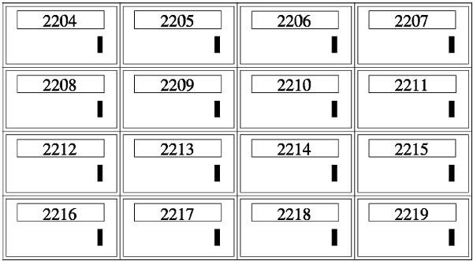
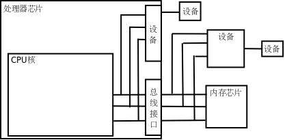
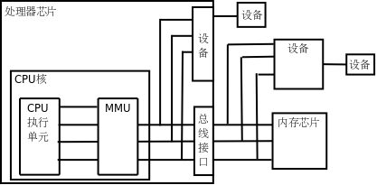
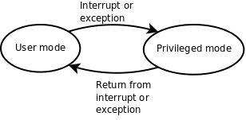

## 第 17 章 计算机体系结构基础

现代计算机都是基于 Von Neumann 体系结构的，不管是嵌入式系统、PC 还是服务器。这种体系结构的主要特点是：CPU（CPU，Central Processing Unit，中央处理器，或简称处理器 Processor）和内存（Memory）是计算机的两个主要组成部分，内存中保存着数据和指令，CPU 从内存中取指令（Fetch）执行，其中有些指令让 CPU 做运算，有些指令让 CPU 读写内存中的数据。本章简要介绍组成计算机的 CPU、内存和设备以及它们之间的关系，为后续章节的学习打下基础。

## 1. 内存与地址

图 17.1. 邮箱的地址

我们都见过像这样挂在墙上的很多个邮箱，每个邮箱有一个房间编号，根据房间编号找到相应的邮箱投入信件或取出信件。内存与此类似，每个内存单元有一个地址（Address），内存地址是从 0 开始编号的整数，CPU 通过地址找到相应的内存单元，取其中的指令或者读写其中的数据。与邮箱不同的是，一个地址所对应的内存单元不能存很多东西，只能存一个字节，以前讲过的 `int`、`float` 等多字节的数据类型保存在内存中要占用连续的多个地址，这种情况下数据的地址是它所占内存单元的起始地址。

## 2. CPU

CPU 总是周而复始地做同一件事：从内存取指令，然后解释执行它，然后再取下一条指令，再解释执行。CPU最核心的功能单元包括：

- 寄存器（Register），是 CPU 内部的高速存储器，像内存一样可以存取数据，但比访问内存快得多。随后的几章我们会详细介绍 x86 的寄存器 `eax`、`esp`、`eip` 等等，有些寄存器只能用于某种特定的用途，比如 `eip` 用作程序计数器，这称为特殊寄存器（Special-purpose Register），而另外一些寄存器可以用在各种运算和读写内存的指令中，比如 `eax` 寄存器，这称为通用寄存器（General-purpose Register）。
- 程序计数器（PC，Program Counter），是一种特殊寄存器，保存着 CPU 取下一条指令的地址，CPU 按程序计数器保存的地址去内存中取指令然后解释执行，这时程序计数器保存的地址会自动加上该指令的长度，指向内存中的下一条指令。
- 指令译码器（Instruction Decoder）。CPU 取上来的指令由若干个字节组成，这些字节中有些位表示内存地址，有些位表示寄存器编号，有些位表示这种指令做什么操作，是加减乘除还是读写内存，指令译码器负责解释这条指令的含义，然后调动相应的执行单元去执行它。
- 算术逻辑单元（ALU，Arithmetic and Logic Unit）。如果译码器将一条指令解释为运算指令，就调动算术逻辑单元去做运算，比如加减乘除、位运算、逻辑运算。指令中会指示运算结果保存到哪里，可能保存到寄存器中，也可能保存到内存中。
- 地址和数据总线（Bus）。CPU 和内存之间用地址总线、数据总线和控制线连接起来，每条线上有 1 和 0 两种状态。如果在执行指令过程中需要访问内存，比如从内存读一个数到寄存器，执行过程可以想像成这样：

图 17.2. 访问内存读数据的过程

1. CPU 内部将寄存器对接到数据总线上，使寄存器的每一位对接到一条数据线，等待接收数据。
2. CPU 通过控制线发一个读请求，并且将内存地址通过地址线发给内存。
3. 内存收到地址和读请求之后，将相应的内存单元对接到数据总线的另一端，这样，内存单元每一位的 1 或 0 状态通过一条数据线到达 CPU 寄存器中相应的位，就完成了数据传送。
	往内存里写数据的过程与此类似，只是数据线上的传输方向相反。

上图中画了 32 条地址线和 32 条数据线，CPU 寄存器也是 32 位，可以说这种体系结构是 32 位的，比如 x86 就是这样的体系结构，目前主流的处理器是 32 位或 64 位的。地址线、数据线和 CPU 寄存器的位数通常是一致的，从上图可以看出数据线和 CPU 寄存器的位数应该一致，另外有些寄存器（比如程序计数器）需要保存一个内存地址，因而地址线和 CPU 寄存器的位数也应该一致。处理器的位数也称为字长，字（Word）这个概念用得比较混乱，在有些上下文中指 16 位，在有些上下文中指 32 位（这种情况下 16 位被称为半字 Half Word），在有些上下文中指处理器的字长，如果处理器是 32 位那么一个字就是 32 位，如果处理器是 64 位那么一个字就是 64 位。32 位计算机有 32 条地址线，地址空间（Address Space）从 `0x00000000` 到 `0xffffffff`，共 4GB，而 64 位计算机有更大的地址空间。

最后还要说明一点，本节所说的地址线、数据线是指 CPU 的内总线，是直接和 CPU 的执行单元相连的，内总线经过 MMU 和总线接口的转换之后引出到芯片引脚才是外总线，外地址线和外数据线的位数都有可能和内总线不同，例如 32 位处理器的外地址总线可寻址的空间可以大于 4GB，到[本章第 4 节「MMU」]()再详细解释。

我们结合[第 1 章表 1.1 「一个语句的三种表示」]()看一下 CPU 取指执行的过程。

图 17.3. CPU的取指执行过程

1. `eip` 寄存器指向地址 `0x80483a2`，CPU 从这里开始取一条 5 个字节的指令，然后 `eip` 寄存器指向下一条指令的起始地址 `0x80483a7`。
2. CPU 对这 5 个字节译码，得知这条指令要求从地址 `0x804a01c` 开始取 4 个字节保存到 `eax` 寄存器。
3. 执行指令，读内存，取上来的数是 `3`，保存到`eax`寄存器。注意，地址 `0x804a01c` ~ `0x804a01f` 里存储的四个字节不能按地址从低到高的顺序看成 `0x03000000`，而要按地址从高到低的顺序看成 `0x00000003`。也就是说，对于多字节的整数类型，低地址保存的是整数的低位，这称为小端（Little  Endian）字节序（Byte Order）。x86 平台是小端字节序的，而另外一些平台规定低地址保存整数的高位，称为大端（Big Endian）字节序。
4. CPU 从 `eip` 寄存器指向的地址取一条 3 个字节的指令，然后 `eip` 寄存器指向下一条指令的起始地址 `0x80483aa`。
5. CPU 对这 3 个字节译码，得知这条指令要求把 `eax` 寄存器的值加 1，结果仍保存到 `eax` 寄存器。
6. 执行指令，现在 `eax` 寄存器中的数是 4。
7. CPU从 `eip` 寄存器指向的地址取一条 5 个字节的指令，然后 `eip` 寄存器指向下一条指令的起始地址 `0x80483af`。
8. CPU对这 5 个字节译码，得知这条指令要求把 `eax` 寄存器的值保存到从地址 `0x804a018` 开始的 4 个字节。
9. 执行指令，把 4 这个值保存到从地址 `0x804a018` 开始的 4 个字节（按小端字节序保存）。

## 3. 设备

CPU 执行指令除了访问内存之外还要访问很多设备（Device），如键盘、鼠标、硬盘、显示器等，那么它们和 CPU 之间如何连接呢？如下图所示。

图 17.4. 设备

有些设备像内存芯片一样连接到处理器的地址总线和数据总线，正因为地址线和数据线上可以挂多个设备和内存芯片所以才叫「总线」，但不同的设备和内存芯片应该占不同的地址范围。访问这种设备就像访问内存一样，按地址读写即可，但和访问内存不同的是，往一个地址写数据只是给设备发一个命令，数据不一定要保存，而从一个地址读数据也不一定是读先前保存在这个地址的数据，而是得到设备的当前状态。设备中可供读写访问的单元通常称为设备寄存器（注意和 CPU 寄存器不是一回事），操作设备的过程就是读写这些设备寄存器的过程，比如向串口发送寄存器里写数据，串口设备就会把数据发送出去，读串口接收寄存器的值，就可以读取串口设备接收到的数据。

还有一些设备集成在处理器芯片中。在上图中，从 CPU 核引出的地址和数据总线有一端经总线接口引出到芯片引脚上了，还有一端没有引出，而是接到芯片内部集成的设备上，无论是在 CPU 外部接总线的设备还是在 CPU 内部接总线的设备都有各自的地址范围，都可以像访问内存一样访问，很多体系结构（比如 ARM）采用这种方式操作设备，称为**内存映射 I/O（Memory-mapped I/O）**。但是 x86 比较特殊，x86 对于设备有独立的端口地址空间，CPU 核需要引出额外的地址线来连接片内设备（和访问内存所用的地址线不同），访问设备寄存器时用特殊的 `in` / `out` 指令，而不是和访问内存用同样的指令，这种方式称为**端口 I/O（Port I/O）**。

从 CPU 的角度来看，访问设备只有内存映射 I/O 和端口 I/O 两种，要么像内存一样访问，要么用一种专用的指令访问。其实访问设备是相当复杂的，计算机的设备五花八门，各种设备的性能要求都不一样，有的要求带宽大，有的要求响应快，有的要求热插拔，于是出现了各种适应不同要求的设备总线，比如 PCI、AGP、USB、1394、SATA 等等，这些设备总线并不直接和 CPU 相连，CPU 通过内存映射 I/O 或端口 I/O 访问相应的总线控制器，通过总线控制器再去访问挂在总线上的设备。所以上图中标有「设备」的框可能是实际的设备，也可能是设备总线的控制器。

在 x86 平台上，硬盘是挂在 IDE、SATA 或 SCSI 总线上的设备，保存在硬盘上的程序是不能被 CPU 直接取指令执行的，操作系统在执行程序时会把它从硬盘拷贝到内存，这样 CPU 才能取指令执行，这个过程称为加载（Load）。程序加载到内存之后，成为操作系统调度执行的一个任务，就称为进程（Process）。进程和程序不是一一对应的。一个程序可以多次加载到内存，成为同时运行的多个进程，例如可以同时开多个终端窗口，每个窗口都运行一个 Shell 进程，而它们对应的程序都是磁盘上的 `/bin/bash` 文件。

操作系统（Operating System）本身也是一段保存在磁盘上的程序，计算机在启动时执行一段固定的启动代码（称为 Bootloader）首先把操作系统从磁盘加载到内存，然后执行操作系统中的代码把用户需要的其它程序加载到内存。操作系统和其它用户程序的不同之处在于：操作系统是常驻内存的，而其它用户程序则不一定，用户需要运行哪个程序，操作系统就把它加载到内存，用户不需要哪个程序，操作系统就把它终止掉，释放它所占的内存。操作系统最核心的功能是管理进程调度、管理内存的分配使用和管理各种设备，做这些工作的程序称为内核（Kernel），在我的系统上内核程序是 `/boot/vmlinuz-2.6.28-13-generic` 文件，它在计算机启动时加载到内存并常驻内存。广义上操作系统的概念还包括一些必不可少的用户程序，比如 Shell 是每个 Linux 系统必不可少的，而 Office 办公套件则是可有可无的，所以前者也属于广义上操作系统的范畴，而后者属于应用软件。

访问设备还有一点和访问内存不同。内存只是保存数据而不会产生新的数据，如果 CPU 不去读它，它也不需要主动提供数据给 CPU，所以内存总是被动地等待被读或者被写。而设备往往会自己产生数据，并且需要主动通知 CPU 来读这些数据，例如敲键盘产生一个输入字符，用户希望计算机马上响应自己的输入，这就要求键盘设备主动通知 CPU 来读这个字符并做相应处理，给用户响应。这是由中断（Interrupt）机制实现的，每个设备都有一条中断线，通过中断控制器连接到 CPU，当设备需要主动通知 CPU 时就引发一个中断信号，CPU 正在执行的指令将被打断，程序计数器会指向某个固定的地址（这个地址由体系结构定义），于是 CPU 从这个地址开始取指令（或者说跳转到这个地址），执行中断服务程序（ISR，Interrupt  Service Routine），完成中断处理之后再返回先前被打断的地方执行后续指令。比如某种体系结构规定发生中断时跳转到地址 `0x00000010` 执行，那么就要事先把一段 ISR 程序加载到这个地址，ISR 程序是内核代码的一部分，在这段代码中首先判断是哪个设备引发了中断，然后调用该设备的中断处理函数做进一步处理。

由于各种设备的操作方法各不相同，每种设备都需要专门的设备驱动程序（Device Driver），一个操作系统为了支持广泛的设备就需要有大量的设备驱动程序，事实上 Linux 内核源代码中绝大部分是设备驱动程序。设备驱动程序通常是内核里的一组函数，通过读写设备寄存器实现对设备的初始化、读、写等操作，有些设备还要提供一个中断处理函数供 ISR 调用。

## 4. MMU

现代操作系统普遍采用虚拟内存管理（Virtual Memory Management）机制，这需要处理器中的MMU（Memory Management Unit，内存管理单元）提供支持，本节简要介绍 MMU 的作用。

首先引入两个概念，虚拟地址和物理地址。如果处理器没有 MMU，或者有 MMU 但没有启用，CPU 执行单元发出的内存地址将直接传到芯片引脚上，被内存芯片（以下称为物理内存，以便与虚拟内存区分）接收，这称为物理地址（Physical Address，以下简称 PA），如下图所示。

图 17.5. 物理地址

如果处理器启用了 MMU，CPU 执行单元发出的内存地址将被 MMU 截获，从 CPU 到 MMU 的地址称为虚拟地址（Virtual Address，以下简称 VA），而 MMU 将这个地址翻译成另一个地址发到 CPU 芯片的外部地址引脚上，也就是将 VA 映射成 PA，如下图所示。

图 17.6. 虚拟地址

如果是 32 位处理器，则内地址总线是 32 位的，与 CPU 执行单元相连（图中只是示意性地画了 4 条地址线），而经过 MMU 转换之后的外地址总线则不一定是 32 位的。也就是说，虚拟地址空间和物理地址空间是独立的，32 位处理器的虚拟地址空间是 4GB，而物理地址空间既可以大于也可以小于 4GB。

MMU 将 VA 映射到 PA 是以页（Page）为单位的，32 位处理器的页尺寸通常是 4KB。例如，MMU 可以通过一个映射项将 VA 的一页 `0xb7001000` ~ `0xb7001fff` 映射到 PA 的一页 `0x2000` ~ `0x2fff`，如果 CPU 执行单元要访问虚拟地址 `0xb7001008`，则实际访问到的物理地址是 `0x2008`。物理内存中的页称为物理页面或者页帧（Page  Frame）。虚拟内存的哪个页面映射到物理内存的哪个页帧是通过页表（Page Table）来描述的，页表保存在物理内存中，MMU 会查找页表来确定一个VA应该映射到什么 PA。

操作系统和MMU是这样配合的：

1. 操作系统在初始化或分配、释放内存时会执行一些指令在物理内存中填写页表，然后用指令设置 MMU，告诉 MMU 页表在物理内存中的什么位置。
2. 设置好之后，CPU 每次执行访问内存的指令都会自动引发 MMU 做查表和地址转换操作，地址转换操作由硬件自动完成，不需要用指令控制 MMU 去做。

我们在程序中使用的变量和函数都有各自的地址，程序被编译后，这些地址就成了指令中的地址，指令中的地址被 CPU 解释执行，就成了 CPU 执行单元发出的内存地址，所以在启用 MMU 的情况下，程序中使用的地址都是虚拟地址，都会引发 MMU 做查表和地址转换操作。那为什么要设计这么复杂的内存管理机制呢？多了一层 VA 到 PA 的转换到底换来了什么好处？*All  problems in computer science can be solved by another level of  indirection.* 还记得这句话吗？多了一层间接必然是为了解决什么问题的，等讲完了必要的预备知识之后，将在[第 20 章第 5 节「虚拟内存管理」]()讨论虚拟内存管理机制的作用。

MMU 除了做地址转换之外，还提供内存保护机制。各种体系结构都有用户模式（User Mode）和特权模式（Privileged Mode）之分，操作系统可以在页表中设置每个内存页面的访问权限，有些页面不允许访问，有些页面只有在 CPU 处于特权模式时才允许访问，有些页面在用户模式和特权模式都可以访问，访问权限又分为可读、可写和可执行三种。这样设定好之后，当 CPU 要访问一个 VA 时，MMU 会检查 CPU 当前处于用户模式还是特权模式，访问内存的目的是读数据、写数据还是取指令，如果和操作系统设定的页面权限相符，就允许访问，把它转换成 PA，否则不允许访问，产生一个异常（Exception）。异常的处理过程和中断类似，不同的是中断由外部设备产生而异常由 CPU内部产生，中断产生的原因和 CPU 当前执行的指令无关，而异常的产生就是由于 CPU 当前执行的指令出了问题，例如访问内存的指令被 MMU 检查出权限错误，除法指令的除数为 0 等都会产生异常。

图 17.7. 处理器模式

通常操作系统把虚拟地址空间划分为用户空间和内核空间，例如 x86 平台的 Linux 系统虚拟地址空间是 `0x00000000` ~ `0xffffffff`，前 3GB（`0x00000000` ~ `0xbfffffff`）是用户空间，后 1GB（`0xc0000000` ~ `0xffffffff`）是内核空间。用户程序加载到用户空间，在用户模式下执行，不能访问内核中的数据，也不能跳转到内核代码中执行。这样可以保护内核，如果一个进程访问了非法地址，顶多这一个进程崩溃，而不会影响到内核和整个系统的稳定性。CPU 在产生中断或异常时不仅会跳转到中断或异常服务程序，还会自动切换模式，从用户模式切换到特权模式，因此从中断或异常服务程序可以跳转到内核代码中执行。事实上，整个内核就是由各种中断和异常处理程序组成的。总结一下：在正常情况下处理器在用户模式执行用户程序，在中断或异常情况下处理器切换到特权模式执行内核程序，处理完中断或异常之后再返回用户模式继续执行用户程序。

段错误我们已经遇到过很多次了，它是这样产生的：

1. 用户程序要访问的一个 VA，经 MMU 检查无权访问。
2. MMU 产生一个异常，CPU 从用户模式切换到特权模式，跳转到内核代码中执行异常服务程序。
3. 内核把这个异常解释为段错误，把引发异常的进程终止掉。

## 5. Memory Hierarchy

硬盘、内存、CPU 寄存器，还有本节要讲的 Cache，这些都是存储器，计算机为什么要有这么多种存储器呢？这些存储器各自有什么特点？这是本节要讨论的问题。

由于硬件技术的限制，我们可以制造出容量很小但很快的存储器，也可以制造出容量很大但很慢的存储器，但不可能两边的好处都占着，不可能制造出访问速度又快容量又大的存储器。因此，现代计算机都把存储器分成若干级，称为 Memory Hierarchy，按照离 CPU 由近到远的顺序依次是 CPU 寄存器、Cache、内存、硬盘，越靠近 CPU 的存储器容量越小但访问速度越快，下图给出了各种存储器的容量和访问速度的典型值。

图 17.8. Memory Hierarchy

表 17.1. Memory Hierarchy

| 存储器类型 | 位于哪里                                                     | 存储容量                                                     | 半导体工艺                                                   | 访问时间                                                     | 如何访问                                                     |
| ---------- | ------------------------------------------------------------ | ------------------------------------------------------------ | ------------------------------------------------------------ | ------------------------------------------------------------ | ------------------------------------------------------------ |
| CPU 寄存器 | 位于 CPU 执行单元中。                                        | CPU 寄存器通常只有几个到几十个，每个寄存器的容量取决于 CPU 的字长，所以一共只有几十到几百字节。 | 「寄存器」这个名字就是一种数字电路的名字，它由一组触发器（Flip-flop）组成，每个触发器保存一个Bit的数据，可以做存取和移位等操作。计算机掉电时寄存器中保存的数据会丢失。 | 寄存器是访问速度最快的存储器，典型的访问时间是几纳秒。       | 使用哪个寄存器，如何使用寄存器，这些都是由指令决定的。       |
| Cache      | 和 MMU 一样位于 CPU 核中。                                   | Cache 通常分为几级，最典型的是如上图所示的两级 Cache，一级 Cache 更靠近CPU 执行单元，二级 Cache 更靠近物理内存，通常一级 Cache 有几十到几百KB，二级 Cache 有几百 KB 到几 MB。 | Cache 和内存都是由 RAM（Random Access Memory）组成的，可以根据地址随机访问，计算机掉电时 RAM 中保存的数据会丢失。不同的是，Cache 通常由 SRAM（Static RAM，静态 RAM）组成，而内存通常由 DRAM（Dynamic RAM，动态 RAM）组成。DRAM 电路比SRAM 简单，存储容量可以做得更大，但 DRAM 的访问速度比 SRAM 慢。 | 典型的访问时间是几十纳秒。                                   | Cache 缓存最近访问过的内存数据，由于 Cache 的访问速度是内存的几十倍，所以有效利用 Cache 可以大大提高计算机的整体性能。一级 Cache 是这样工作的：CPU 执行单元要访问内存时首先发出 VA，Cache 利用 VA 查找相应的数据有没有被缓存，如果 Cache 中有就不需要访问物理内存了，如果是读操作就直接将 Cache 中的数据传给 CPU 寄存器，如果是写操作就直接改写到 Cache 中；如果 Cache 没有缓存该数据，就去物理内存中取数据，但并不是要哪个字节就取哪个字节，而是把相邻的几十个字节都取上来缓存着，以备下次用到，这称为一个 Cache  Line，典型的 Cache  Line 大小是 32 ~ 256 字节。如果计算机还配置了二级缓存，则在访问物理内存之前先用 PA 去二级缓存中查找。一级缓存是用 VA 寻址的，二级缓存是用 PA 寻址的，这是它们的区别。Cache 所做的工作是由硬件自动完成的，而不是像寄存器一样由指令决定先做什么后做什么。 |
| 内存       | 位于 CPU 外的芯片，与 CPU 通过地址和数据总线相连。           | 典型的存储容量是几百 MB 到几 GB。                            | 由 DRAM 组成，详见上面关于 Cache 的说明。                    | 典型的访问时间是几百纳秒。                                   | 内存是通过地址来访问的，在启用 MMU 的情况下，程序指令中的地址是 VA，而访问内存用的是 PA，它们之间的映射关系由操作系统维护。 |
| 硬盘       | 位于设备总线上，并不直接和 CPU 相连，CPU 通过设备总线的控制器访问硬盘。 | 典型的存储容量是几百 GB 到几 TB。                            | 硬盘由磁性介质和磁头组成，访问硬盘时存在机械运动，磁头要移动，磁性介质要旋转，机械运动的速度很难提高到电子的速度，所以访问速度很受限制。保存在硬盘上的数据掉电后不会丢失。 | 典型的访问时间是几毫秒，是寄存器访问时间的 106 倍。 | 由驱动程序操作设备总线控制器去访问。由于硬盘的访问速度较慢，操作系统通常一次从硬盘上读几个页面到内存中缓存起来，如果这几个页面后来都被程序访问到了，那么这一次读硬盘的时间就可以分摊（Amortize）给程序的多次访问了。 |

对这个表格总结如下。

- 寄存器、Cache 和内存中的数据都是掉电丢失的，这称为易失性存储器（Volatile Memory），与之相对的，硬盘是一种非易失性存储器（Non-volatile Memory）。
- 除了访问寄存器由程序指令直接控制之外，访问其它存储器都不是由指令直接控制的，有些是硬件自动完成的，有些是操作系统配合硬件完成的。
- Cache 从内存取数据时会预取一个 Cache Line 缓存起来，操作系统从硬盘读数据时会预读几个页面缓存起来，都是希望这些数据以后会被程序访问到。大多数程序的行为都具有局部性（Locality）的特点：它们会花费大量的时间反复执行一小段代码（例如循环），或者反复访问一个很小的地址范围中的数据（例如访问一个数组）。所以预读缓存的办法是很有效的：CPU 取一条指令，我把和它相邻的指令也都缓存起来，CPU 很可能马上就会取到；CPU 访问一个数据，我把和它相邻的数据也都缓存起来，CPU 很可能马上就会访问到。设想有两台计算机，一台有 256KB 的 Cache，另一台没有 Cache，两台计算机的内存都是 512MB 的，硬盘都是 100GB 的，虽然多出来 256KB 的 Cache 与内存、硬盘的容量相比微不足道，但访问 Cache 比访问内存、硬盘快几个数量级，由于局部性原理，CPU 大部分时间是在和 Cache 打交道，有 Cache 的计算机明显会快很多。高速存储器的容量只能做得很小，却能显著提升计算机的性能，这就是 Memory  Hierarchy 的意义所在。