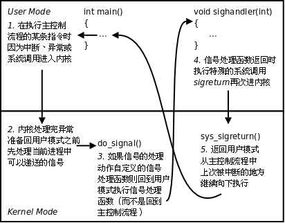
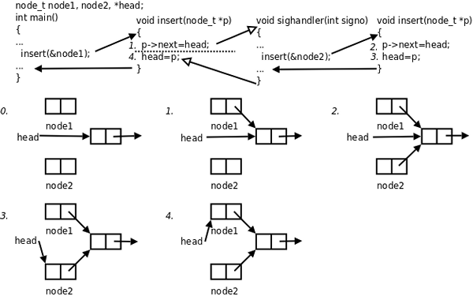

# 第 33 章 信号

## 1. 信号的基本概念

为了理解信号，先从我们最熟悉的场景说起：

1. 用户输入命令，在Shell下启动一个前台进程。
2. 用户按下Ctrl-C，这个键盘输入产生一个硬件中断。
3. 如果CPU当前正在执行这个进程的代码，则该进程的用户空间代码暂停执行，CPU从用户态切换到内核态处理硬件中断。
4. 终端驱动程序将Ctrl-C解释成一个`SIGINT`信号，记在该进程的PCB中（也可以说发送了一个`SIGINT`信号给该进程）。
5. 当某个时刻要从内核返回到该进程的用户空间代码继续执行之前，首先处理PCB中记录的信号，发现有一个`SIGINT`信号待处理，而这个信号的默认处理动作是终止进程，所以直接终止进程而不再返回它的用户空间代码执行。

注意，Ctrl-C产生的信号只能发给前台进程。在[第 3.3 节 「wait和waitpid函数」](ch30s03.html#process.wait)中我们看到一个命令后面加个`&`可以放到后台运行，这样Shell不必等待进程结束就可以接受新的命令，启动新的进程。Shell可以同时运行一个前台进程和任意多个后台进程，只有前台进程才能接到像Ctrl-C这种控制键产生的信号。前台进程在运行过程中用户随时可能按下Ctrl-C而产生一个信号，也就是说该进程的用户空间代码执行到任何地方都有可能收到`SIGINT`信号而终止，所以信号相对于进程的控制流程来说是异步（Asynchronous）的。

用`kill -l`命令可以察看系统定义的信号列表：

```
$ kill -l
 1) SIGHUP       2) SIGINT       3) SIGQUIT      4) SIGILL
 5) SIGTRAP      6) SIGABRT      7) SIGBUS       8) SIGFPE
 9) SIGKILL     10) SIGUSR1     11) SIGSEGV     12) SIGUSR2
13) SIGPIPE     14) SIGALRM     15) SIGTERM     16) SIGSTKFLT
17) SIGCHLD     18) SIGCONT     19) SIGSTOP     20) SIGTSTP
21) SIGTTIN     22) SIGTTOU     23) SIGURG      24) SIGXCPU
25) SIGXFSZ     26) SIGVTALRM   27) SIGPROF     28) SIGWINCH
29) SIGIO       30) SIGPWR      31) SIGSYS      34) SIGRTMIN
35) SIGRTMIN+1  36) SIGRTMIN+2  37) SIGRTMIN+3  38) SIGRTMIN+4
...
```

每个信号都有一个编号和一个宏定义名称，这些宏定义可以在`signal.h`中找到，例如其中有定义`#define SIGINT 2`。编号34以上的是实时信号，本章只讨论编号34以下的信号，不讨论实时信号。这些信号各自在什么条件下产生，默认的处理动作是什么，在`signal(7)`中都有详细说明：

```
Signal     Value     Action   Comment
-------------------------------------------------------------------------
SIGHUP        1       Term    Hangup detected on controlling terminal
                              or death of controlling process
SIGINT        2       Term    Interrupt from keyboard
SIGQUIT       3       Core    Quit from keyboard
SIGILL        4       Core    Illegal Instruction
...
```

上表中第一列是各信号的宏定义名称，第二列是各信号的编号，第三列是默认处理动作，`Term`表示终止当前进程，`Core`表示终止当前进程并且Core Dump（下一节详细介绍什么是Core Dump），`Ign`表示忽略该信号，`Stop`表示停止当前进程，`Cont`表示继续执行先前停止的进程，表中最后一列是简要介绍，说明什么条件下产生该信号。

产生信号的条件主要有：

- 用户在终端按下某些键时，终端驱动程序会发送信号给前台进程，例如Ctrl-C产生`SIGINT`信号，Ctrl-\产生`SIGQUIT`信号，Ctrl-Z产生`SIGTSTP`信号（可使前台进程停止，这个信号将在[第 34 章 *终端、作业控制与守护进程*](ch34.html#jobs)详细解释）。
- 硬件异常产生信号，这些条件由硬件检测到并通知内核，然后内核向当前进程发送适当的信号。例如当前进程执行了除以0的指令，CPU的运算单元会产生异常，内核将这个异常解释为`SIGFPE`信号发送给进程。再比如当前进程访问了非法内存地址，，MMU会产生异常，内核将这个异常解释为`SIGSEGV`信号发送给进程。
- 一个进程调用`kill(2)`函数可以发送信号给另一个进程。
- 可以用`kill(1)`命令发送信号给某个进程，`kill(1)`命令也是调用`kill(2)`函数实现的，如果不明确指定信号则发送`SIGTERM`信号，该信号的默认处理动作是终止进程。
- 当内核检测到某种软件条件发生时也可以通过信号通知进程，例如闹钟超时产生`SIGALRM`信号，向读端已关闭的管道写数据时产生`SIGPIPE`信号。

如果不想按默认动作处理信号，用户程序可以调用`sigaction(2)`函数告诉内核如何处理某种信号（`sigaction`函数稍后详细介绍），可选的处理动作有以下三种：

1. 忽略此信号。
2. 执行该信号的默认处理动作。
3. 提供一个信号处理函数，要求内核在处理该信号时切换到用户态执行这个处理函数，这种方式称为捕捉（Catch）一个信号。

## 2. 产生信号

### 2.1. 通过终端按键产生信号

上一节讲过，`SIGINT`的默认处理动作是终止进程，`SIGQUIT`的默认处理动作是终止进程并且Core Dump，现在我们来验证一下。

首先解释什么是Core Dump。当一个进程要异常终止时，可以选择把进程的用户空间内存数据全部保存到磁盘上，文件名通常是`core`，这叫做Core Dump。进程异常终止通常是因为有Bug，比如非法内存访问导致段错误，事后可以用调试器检查`core`文件以查清错误原因，这叫做Post-mortem Debug。一个进程允许产生多大的`core`文件取决于进程的Resource Limit（这个信息保存在PCB中）。默认是不允许产生`core`文件的，因为`core`文件中可能包含用户密码等敏感信息，不安全。在开发调试阶段可以用`ulimit`命令改变这个限制，允许产生`core`文件。

首先用`ulimit`命令改变Shell进程的Resource Limit，允许`core`文件最大为1024K：

```
$ ulimit -c 1024
```

然后写一个死循环程序：

```
#include <unistd.h>

int main(void)
{
	while(1);
	return 0;
}
```

前台运行这个程序，然后在终端键入Ctrl-C或Ctrl-\：

```
$ ./a.out
（按Ctrl-C）
$ ./a.out
（按Ctrl-\）Quit (core dumped)
$ ls -l core*
-rw------- 1 akaedu akaedu 147456 2008-11-05 23:40 core
```

`ulimit`命令改变了Shell进程的Resource Limit，`a.out`进程的PCB由Shell进程复制而来，所以也具有和Shell进程相同的Resource Limit值，这样就可以产生Core Dump了。

### 2.2. 调用系统函数向进程发信号

仍以上一节的死循环程序为例，首先在后台执行这个程序，然后用`kill`命令给它发`SIGSEGV`信号。

```
$ ./a.out &
[1] 7940
$ kill -SIGSEGV 7940
$（再次回车）
[1]+  Segmentation fault      (core dumped) ./a.out
```

7940是`a.out`进程的id。之所以要再次回车才显示`Segmentation fault`，是因为在7940进程终止掉之前已经回到了Shell提示符等待用户输入下一条命令，Shell不希望`Segmentation fault`信息和用户的输入交错在一起，所以等用户输入命令之后才显示。指定某种信号的`kill`命令可以有多种写法，上面的命令还可以写成`kill -SEGV 7940`或`kill -11 7940`，11是信号`SIGSEGV`的编号。以往遇到的段错误都是由非法内存访问产生的，而这个程序本身没错，给它发`SIGSEGV`也能产生段错误。

`kill`命令是调用`kill`函数实现的。`kill`函数可以给一个指定的进程发送指定的信号。`raise`函数可以给当前进程发送指定的信号（自己给自己发信号）。

```
#include <signal.h>

int kill(pid_t pid, int signo);
int raise(int signo);
```

这两个函数都是成功返回0，错误返回-1。

`abort`函数使当前进程接收到`SIGABRT`信号而异常终止。

```
#include <stdlib.h>

void abort(void);
```

就像`exit`函数一样，`abort`函数总是会成功的，所以没有返回值。

### 2.3. 由软件条件产生信号

`SIGPIPE`是一种由软件条件产生的信号，在[例 30.7 「管道」](ch30s04.html#process.pipe)中已经介绍过了。本节主要介绍`alarm`函数和`SIGALRM`信号。

```
#include <unistd.h>

unsigned int alarm(unsigned int seconds);
```

调用`alarm`函数可以设定一个闹钟，也就是告诉内核在`seconds`秒之后给当前进程发`SIGALRM`信号，该信号的默认处理动作是终止当前进程。这个函数的返回值是0或者是以前设定的闹钟时间还余下的秒数。打个比方，某人要小睡一觉，设定闹钟为30分钟之后响，20分钟后被人吵醒了，还想多睡一会儿，于是重新设定闹钟为15分钟之后响，「以前设定的闹钟时间还余下的时间」就是10分钟。如果`seconds`值为0，表示取消以前设定的闹钟，函数的返回值仍然是以前设定的闹钟时间还余下的秒数。

**例 33.1. alarm**

```
#include <unistd.h>
#include <stdio.h>

int main(void)
{
	int counter;
	alarm(1);
	for(counter=0; 1; counter++)
		printf("counter=%d ", counter);
	return 0;
}
```

这个程序的作用是1秒钟之内不停地数数，1秒钟到了就被`SIGALRM`信号终止。

## 3. 阻塞信号

### 3.1. 信号在内核中的表示

以上我们讨论了信号*产生*（Generation）的各种原因，而实际执行信号的处理动作称为信号*递达*（Delivery），信号从产生到递达之间的状态，称为信号*未决*（Pending）。进程可以选择阻塞（Block）某个信号。被阻塞的信号产生时将保持在未决状态，直到进程解除对此信号的阻塞，才执行递达的动作。注意，阻塞和忽略是不同的，只要信号被阻塞就不会递达，而忽略是在递达之后可选的一种处理动作。信号在内核中的表示可以看作是这样的：

**图 33.1. 信号在内核中的表示示意图**


每个信号都有两个标志位分别表示阻塞和未决，还有一个函数指针表示处理动作。信号产生时，内核在进程控制块中设置该信号的未决标志，直到信号递达才清除该标志。在上图的例子中，

1. `SIGHUP`信号未阻塞也未产生过，当它递达时执行默认处理动作。
2. `SIGINT`信号产生过，但正在被阻塞，所以暂时不能递达。虽然它的处理动作是忽略，但在没有解除阻塞之前不能忽略这个信号，因为进程仍有机会改变处理动作之后再解除阻塞。
3. `SIGQUIT`信号未产生过，一旦产生`SIGQUIT`信号将被阻塞，它的处理动作是用户自定义函数`sighandler`。

如果在进程解除对某信号的阻塞之前这种信号产生过多次，将如何处理？POSIX.1允许系统递送该信号一次或多次。Linux是这样实现的：常规信号在递达之前产生多次只计一次，而实时信号在递达之前产生多次可以依次放在一个队列里。本章不讨论实时信号。从上图来看，每个信号只有一个bit的未决标志，非0即1，不记录该信号产生了多少次，阻塞标志也是这样表示的。因此，未决和阻塞标志可以用相同的数据类型`sigset_t`来存储，`sigset_t`称为信号集，这个类型可以表示每个信号的「有效」或「无效」状态，在阻塞信号集中「有效」和「无效」的含义是该信号是否被阻塞，而在未决信号集中「有效」和「无效」的含义是该信号是否处于未决状态。下一节将详细介绍信号集的各种操作。阻塞信号集也叫做当前进程的信号屏蔽字（Signal Mask），这里的「屏蔽」应该理解为阻塞而不是忽略。

### 3.2. 信号集操作函数

`sigset_t`类型对于每种信号用一个bit表示「有效」或「无效」状态，至于这个类型内部如何存储这些bit则依赖于系统实现，从使用者的角度是不必关心的，使用者只能调用以下函数来操作`sigset_t`变量，而不应该对它的内部数据做任何解释，比如用`printf`直接打印`sigset_t`变量是没有意义的。

```
#include <signal.h>

int sigemptyset(sigset_t *set);
int sigfillset(sigset_t *set);
int sigaddset(sigset_t *set, int signo);
int sigdelset(sigset_t *set, int signo);
int sigismember(const sigset_t *set, int signo);
```

函数`sigemptyset`初始化`set`所指向的信号集，使其中所有信号的对应bit清零，表示该信号集不包含任何有效信号。函数`sigfillset`初始化`set`所指向的信号集，使其中所有信号的对应bit置位，表示该信号集的有效信号包括系统支持的所有信号。注意，在使用`sigset_t`类型的变量之前，一定要调用`sigemptyset`或`sigfillset`做初始化，使信号集处于确定的状态。初始化`sigset_t`变量之后就可以在调用`sigaddset`和`sigdelset`在该信号集中添加或删除某种有效信号。这四个函数都是成功返回0，出错返回-1。`sigismember`是一个布尔函数，用于判断一个信号集的有效信号中是否包含某种信号，若包含则返回1，不包含则返回0，出错返回-1。

### 3.3. sigprocmask

调用函数`sigprocmask`可以读取或更改进程的信号屏蔽字。

```
#include <signal.h>

int sigprocmask(int how, const sigset_t *set, sigset_t *oset);
```

返回值：若成功则为0，若出错则为-1

如果`oset`是非空指针，则读取进程的当前信号屏蔽字通过`oset`参数传出。如果`set`是非空指针，则更改进程的信号屏蔽字，参数`how`指示如何更改。如果`oset`和`set`都是非空指针，则先将原来的信号屏蔽字备份到`oset`里，然后根据`set`和`how`参数更改信号屏蔽字。假设当前的信号屏蔽字为`mask`，下表说明了`how`参数的可选值。

**表 33.1. how参数的含义**

| `SIG_BLOCK`   | `set`包含了我们希望添加到当前信号屏蔽字的信号，相当于mask=mask\|set |
| ------------- | ------------------------------------------------------------ |
| `SIG_UNBLOCK` | `set`包含了我们希望从当前信号屏蔽字中解除阻塞的信号，相当于mask=mask&~set |
| `SIG_SETMASK` | 设置当前信号屏蔽字为`set`所指向的值，相当于mask=set          |

如果调用`sigprocmask`解除了对当前若干个未决信号的阻塞，则在`sigprocmask`返回前，至少将其中一个信号递达。

### 3.4. sigpending

```
#include <signal.h>

int sigpending(sigset_t *set);
```

`sigpending`读取当前进程的未决信号集，通过`set`参数传出。调用成功则返回0，出错则返回-1。

下面用刚学的几个函数做个实验。程序如下：

```
#include <signal.h>
#include <stdio.h>
#include <unistd.h>

void printsigset(const sigset_t *set)
{
	int i;
	for (i = 1; i < 32; i++)
		if (sigismember(set, i) == 1)
			putchar('1');
		else
			putchar('0');
	puts("");
}

int main(void)
{
	sigset_t s, p;
	sigemptyset(&s);
	sigaddset(&s, SIGINT);
	sigprocmask(SIG_BLOCK, &s, NULL);
	while (1) {
		sigpending(&p);
		printsigset(&p);
		sleep(1);
	}
	return 0;
}
```

程序运行时，每秒钟把各信号的未决状态打印一遍，由于我们阻塞了`SIGINT`信号，按Ctrl-C将会使`SIGINT`信号处于未决状态，按Ctrl-\仍然可以终止程序，因为`SIGQUIT`信号没有阻塞。

```
$ ./a.out 
0000000000000000000000000000000
0000000000000000000000000000000（这时按Ctrl-C）
0100000000000000000000000000000
0100000000000000000000000000000（这时按Ctrl-\）
Quit (core dumped)
```

## 4. 捕捉信号

### 4.1. 内核如何实现信号的捕捉

如果信号的处理动作是用户自定义函数，在信号递达时就调用这个函数，这称为捕捉信号。由于信号处理函数的代码是在用户空间的，处理过程比较复杂，举例如下：

1. 用户程序注册了`SIGQUIT`信号的处理函数`sighandler`。
2. 当前正在执行`main`函数，这时发生中断或异常切换到内核态。
3. 在中断处理完毕后要返回用户态的`main`函数之前检查到有信号`SIGQUIT`递达。
4. 内核决定返回用户态后不是恢复`main`函数的上下文继续执行，而是执行`sighandler`函数，`sighandler`和`main`函数使用不同的堆栈空间，它们之间不存在调用和被调用的关系，是两个独立的控制流程。
5. `sighandler`函数返回后自动执行特殊的系统调用`sigreturn`再次进入内核态。
6. 如果没有新的信号要递达，这次再返回用户态就是恢复`main`函数的上下文继续执行了。

**图 33.2. 信号的捕捉**



上图出自[[ULK\]](bi01.html#bibli.ulk)。

### 4.2. sigaction

```
#include <signal.h>

int sigaction(int signo, const struct sigaction *act, struct sigaction *oact);
```

`sigaction`函数可以读取和修改与指定信号相关联的处理动作。调用成功则返回0，出错则返回-1。`signo`是指定信号的编号。若`act`指针非空，则根据`act`修改该信号的处理动作。若`oact`指针非空，则通过`oact`传出该信号原来的处理动作。`act`和`oact`指向`sigaction`结构体：

```
struct sigaction {
   void      (*sa_handler)(int);   /* addr of signal handler, */
                                       /* or SIG_IGN, or SIG_DFL */
   sigset_t sa_mask;               /* additional signals to block */
   int      sa_flags;              /* signal options, Figure 10.16 */

   /* alternate handler */
   void     (*sa_sigaction)(int, siginfo_t *, void *);
};
```

将`sa_handler`赋值为常数`SIG_IGN`传给`sigaction`表示忽略信号，赋值为常数`SIG_DFL`表示执行系统默认动作，赋值为一个函数指针表示用自定义函数捕捉信号，或者说向内核注册了一个信号处理函数，该函数返回值为`void`，可以带一个`int`参数，通过参数可以得知当前信号的编号，这样就可以用同一个函数处理多种信号。显然，这也是一个回调函数，不是被`main`函数调用，而是被系统所调用。

当某个信号的处理函数被调用时，内核自动将当前信号加入进程的信号屏蔽字，当信号处理函数返回时自动恢复原来的信号屏蔽字，这样就保证了在处理某个信号时，如果这种信号再次产生，那么它会被阻塞到当前处理结束为止。如果在调用信号处理函数时，除了当前信号被自动屏蔽之外，还希望自动屏蔽另外一些信号，则用`sa_mask`字段说明这些需要额外屏蔽的信号，当信号处理函数返回时自动恢复原来的信号屏蔽字。

`sa_flags`字段包含一些选项，本章的代码都把`sa_flags`设为0，`sa_sigaction`是实时信号的处理函数，本章不详细解释这两个字段，有兴趣的读者参考[[APUE2e\]](bi01.html#bibli.apue)。

### 4.3. pause

```
#include <unistd.h>

int pause(void);
```

`pause`函数使调用进程挂起直到有信号递达。如果信号的处理动作是终止进程，则进程终止，`pause`函数没有机会返回；如果信号的处理动作是忽略，则进程继续处于挂起状态，`pause`不返回；如果信号的处理动作是捕捉，则调用了信号处理函数之后`pause`返回-1，`errno`设置为`EINTR`，所以`pause`只有出错的返回值（想想以前还学过什么函数只有出错返回值？）。错误码`EINTR`表示「被信号中断」。

下面我们用`alarm`和`pause`实现`sleep(3)`函数，称为`mysleep`。

**例 33.2. mysleep**

```
#include <unistd.h>
#include <signal.h>
#include <stdio.h>

void sig_alrm(int signo)
{
	/* nothing to do */
}

unsigned int mysleep(unsigned int nsecs)
{
	struct sigaction newact, oldact;
	unsigned int unslept;

	newact.sa_handler = sig_alrm;
	sigemptyset(&newact.sa_mask);
	newact.sa_flags = 0;
	sigaction(SIGALRM, &newact, &oldact);

	alarm(nsecs);
	pause();

	unslept = alarm(0);
	sigaction(SIGALRM, &oldact, NULL);

	return unslept;
}

int main(void)
{
	while(1){
		mysleep(2);
		printf("Two seconds passed\n");
	}
	return 0;
}
```

1. `main`函数调用`mysleep`函数，后者调用`sigaction`注册了`SIGALRM`信号的处理函数`sig_alrm`。
2. 调用`alarm(nsecs)`设定闹钟。
3. 调用`pause`等待，内核切换到别的进程运行。
4. `nsecs`秒之后，闹钟超时，内核发`SIGALRM`给这个进程。
5. 从内核态返回这个进程的用户态之前处理未决信号，发现有`SIGALRM`信号，其处理函数是`sig_alrm`。
6. 切换到用户态执行`sig_alrm`函数，进入`sig_alrm`函数时`SIGALRM`信号被自动屏蔽，从`sig_alrm`函数返回时`SIGALRM`信号自动解除屏蔽。然后自动执行系统调用`sigreturn`再次进入内核，再返回用户态继续执行进程的主控制流程（`main`函数调用的`mysleep`函数）。
7. `pause`函数返回-1，然后调用`alarm(0)`取消闹钟，调用`sigaction`恢复`SIGALRM`信号以前的处理动作。

以下问题留给读者思考：

1、信号处理函数`sig_alrm`什么都没干，为什么还要注册它作为`SIGALRM`的处理函数？不注册信号处理函数可以吗？

2、为什么在`mysleep`函数返回前要恢复`SIGALRM`信号原来的`sigaction`？

3、`mysleep`函数的返回值表示什么含义？什么情况下返回非0值？。

### 4.4. 可重入函数

当捕捉到信号时，不论进程的主控制流程当前执行到哪儿，都会先跳到信号处理函数中执行，从信号处理函数返回后再继续执行主控制流程。信号处理函数是一个单独的控制流程，因为它和主控制流程是异步的，二者不存在调用和被调用的关系，并且使用不同的堆栈空间。引入了信号处理函数使得一个进程具有多个控制流程，如果这些控制流程访问相同的全局资源（全局变量、硬件资源等），就有可能出现冲突，如下面的例子所示。

**图 33.3. 不可重入函数**



`main`函数调用`insert`函数向一个链表`head`中插入节点`node1`，插入操作分为两步，刚做完第一步的时候，因为硬件中断使进程切换到内核，再次回用户态之前检查到有信号待处理，于是切换到`sighandler`函数，`sighandler`也调用`insert`函数向同一个链表`head`中插入节点`node2`，插入操作的两步都做完之后从`sighandler`返回内核态，再次回到用户态就从`main`函数调用的`insert`函数中继续往下执行，先前做第一步之后被打断，现在继续做完第二步。结果是，`main`函数和`sighandler`先后向链表中插入两个节点，而最后只有一个节点真正插入链表中了。

像上例这样，`insert`函数被不同的控制流程调用，有可能在第一次调用还没返回时就再次进入该函数，这称为重入，`insert`函数访问一个全局链表，有可能因为重入而造成错乱，像这样的函数称为不可重入函数，反之，如果一个函数只访问自己的局部变量或参数，则称为可重入（`Reentrant`）函数。想一下，为什么两个不同的控制流程调用同一个函数，访问它的同一个局部变量或参数就不会造成错乱？

如果一个函数符合以下条件之一则是不可重入的：

- 调用了`malloc`或`free`，因为`malloc`也是用全局链表来管理堆的。
- 调用了标准I/O库函数。标准I/O库的很多实现都以不可重入的方式使用全局数据结构。

SUS规定有些系统函数必须以线程安全的方式实现，这里就不列了，请参考[[APUE2e\]](bi01.html#bibli.apue)。

### 4.5. sig_atomic_t类型与volatile限定符

在上面的例子中，`main`和`sighandler`都调用`insert`函数则有可能出现链表的错乱，其根本原因在于，对全局链表的插入操作要分两步完成，不是一个原子操作，假如这两步操作必定会一起做完，中间不可能被打断，就不会出现错乱了。下一节线程会讲到如何保证一个代码段以原子操作完成。

现在想一下，如果对全局数据的访问只有一行代码，是不是原子操作呢？比如，`main`和`sighandler`都对一个全局变量赋值，会不会出现错乱呢？比如下面的程序：

```
long long a;
int main(void)
{
	a=5;
	return 0;
}
```

带调试信息编译，然后带源代码反汇编：

```
$ gcc main.c -g
$ objdump -dS a.out
```

其中main函数的指令中有：

```
	a=5;
 8048352:       c7 05 50 95 04 08 05    movl   $0x5,0x8049550
 8048359:       00 00 00 
 804835c:       c7 05 54 95 04 08 00    movl   $0x0,0x8049554
 8048363:       00 00 00
```

虽然C代码只有一行，但是在32位机上对一个64位的`long long`变量赋值需要两条指令完成，因此不是原子操作。同样地，读取这个变量到寄存器需要两个32位寄存器才放得下，也需要两条指令，不是原子操作。请读者设想一种时序，`main`和`sighandler`都对这个变量`a`赋值，最后变量`a`的值发生错乱。

如果上述程序在64位机上编译执行，则有可能用一条指令完成赋值，因而是原子操作。如果`a`是32位的`int`变量，在32位机上赋值是原子操作，在16位机上就不是。如果在程序中需要使用一个变量，要保证对它的读写都是原子操作，应该采用什么类型呢？为了解决这些平台相关的问题，C标准定义了一个类型`sig_atomic_t`，在不同平台的C语言库中取不同的类型，例如在32位机上定义`sig_atomic_t`为`int`类型。

在使用`sig_atomic_t`类型的变量时，还需要注意另一个问题。看如下的例子：

```
#include <signal.h>

sig_atomic_t a=0;
int main(void)
{
	/* register a sighandler */
	while(!a); /* wait until a changes in sighandler */
	/* do something after signal arrives */
	return 0;
}
```

为了简洁，这里只写了一个代码框架来说明问题。在`main`函数中首先要注册某个信号的处理函数`sighandler`，然后在一个`while`死循环中等待信号发生，如果有信号递达则执行`sighandler`，在`sighandler`中将`a`改为1，这样再次回到`main`函数时就可以退出`while`循环，执行后续处理。用上面的方法编译和反汇编这个程序，在`main`函数的指令中有：

```
	/* register a sighandler */
	while(!a); /* wait until a changes in sighandler */
 8048352:       a1 3c 95 04 08          mov    0x804953c,%eax
 8048357:       85 c0                   test   %eax,%eax
 8048359:       74 f7                   je     8048352 <main+0xe>
```

将全局变量`a`从内存读到`eax`寄存器，对`eax`和`eax`做AND运算，若结果为0则跳回循环开头，再次从内存读变量`a`的值，可见这三条指令等价于C代码的`while(!a);`循环。如果在编译时加了优化选项，例如：

```
$ gcc main.c -O1 -g
$ objdump -dS a.out
```

则`main`函数的指令中有：

```
 8048352:       83 3d 3c 95 04 08 00    cmpl   $0x0,0x804953c
	/* register a sighandler */
	while(!a); /* wait until a changes in sighandler */
 8048359:       74 fe                   je     8048359 <main+0x15>
```

第一条指令将全局变量`a`的内存单元直接和0比较，如果相等，则第二条指令成了一个死循环，注意，这是一个真正的死循环：即使`sighandler`将`a`改为1，只要没有影响Zero标志位，回到`main`函数后仍然死在第二条指令上，因为不会再次从内存读取变量`a`的值。

是编译器优化得有错误吗？不是的。设想一下，如果程序只有单一的执行流程，只要当前执行流程没有改变`a`的值，`a`的值就没有理由会变，不需要反复从内存读取，因此上面的两条指令和`while(!a);`循环是等价的，并且优化之后省去了每次循环读内存的操作，效率非常高。所以不能说编译器做错了，只能说*编译器无法识别程序中存在多个执行流程*。之所以程序中存在多个执行流程，是因为调用了特定平台上的特定库函数，比如`sigaction`、`pthread_create`，这些不是C语言本身的规范，不归编译器管，程序员应该自己处理这些问题。C语言提供了`volatile`限定符，如果将上述变量定义为`volatile sig_atomic_t a=0;`那么即使指定了优化选项，编译器也不会优化掉对变量a内存单元的读写。

对于程序中存在多个执行流程访问同一全局变量的情况，`volatile`限定符是必要的，此外，虽然程序只有单一的执行流程，但是变量属于以下情况之一的，也需要`volatile`限定：

- 变量的内存单元中的数据不需要写操作就可以自己发生变化，每次读上来的值都可能不一样
- 即使多次向变量的内存单元中写数据，只写不读，也并不是在做无用功，而是有特殊意义的

什么样的内存单元会具有这样的特性呢？肯定不是普通的内存，而是映射到内存地址空间的硬件寄存器，例如串口的接收寄存器属于上述第一种情况，而发送寄存器属于上述第二种情况。

*sig_atomic_t类型的变量应该总是加上volatile限定符*，因为要使用`sig_atomic_t`类型的理由也正是要加`volatile`限定符的理由。

### 4.6. 竞态条件与sigsuspend函数

现在重新审视[例 33.2 「mysleep」](ch33s04.html#signal.mysleep)，设想这样的时序：

1. 注册`SIGALRM`信号的处理函数。
2. 调用`alarm(nsecs)`设定闹钟。
3. 内核调度优先级更高的进程取代当前进程执行，并且优先级更高的进程有很多个，每个都要执行很长时间
4. `nsecs`秒钟之后闹钟超时了，内核发送`SIGALRM`信号给这个进程，处于未决状态。
5. 优先级更高的进程执行完了，内核要调度回这个进程执行。`SIGALRM`信号递达，执行处理函数`sig_alrm`之后再次进入内核。
6. 返回这个进程的主控制流程，`alarm(nsecs)`返回，调用`pause()`挂起等待。
7. 可是`SIGALRM`信号已经处理完了，还等待什么呢？

出现这个问题的根本原因是系统运行的时序（Timing）并不像我们写程序时所设想的那样。虽然`alarm(nsecs)`紧接着的下一行就是`pause()`，但是无法保证`pause()`一定会在调用`alarm(nsecs)`之后的`nsecs`秒之内被调用。由于异步事件在任何时候都有可能发生（这里的异步事件指出现更高优先级的进程），如果我们写程序时考虑不周密，就可能由于时序问题而导致错误，这叫做竞态条件（Race Condition）。

如何解决上述问题呢？读者可能会想到，在调用`pause`之前屏蔽`SIGALRM`信号使它不能提前递达就可以了。看看以下方法可行吗？

1. 屏蔽`SIGALRM`信号;
2. `alarm(nsecs);`
3. 解除对`SIGALRM`信号的屏蔽;
4. `pause();`

从解除信号屏蔽到调用`pause`之间存在间隙，`SIGALRM`仍有可能在这个间隙递达。要消除这个间隙，我们把解除屏蔽移到`pause`后面可以吗？

1. 屏蔽`SIGALRM`信号;
2. `alarm(nsecs);`
3. `pause();`
4. 解除对`SIGALRM`信号的屏蔽;

这样更不行了，还没有解除屏蔽就调用`pause`，`pause`根本不可能等到`SIGALRM`信号。要是「解除信号屏蔽」和「挂起等待信号」这两步能合并成一个原子操作就好了，这正是`sigsuspend`函数的功能。`sigsuspend`包含了`pause`的挂起等待功能，同时解决了竞态条件的问题，在对时序要求严格的场合下都应该调用`sigsuspend`而不是`pause`。

```
#include <signal.h>

int sigsuspend(const sigset_t *sigmask);
```

和`pause`一样，`sigsuspend`没有成功返回值，只有执行了一个信号处理函数之后`sigsuspend`才返回，返回值为-1，`errno`设置为`EINTR`。

调用`sigsuspend`时，进程的信号屏蔽字由`sigmask`参数指定，可以通过指定`sigmask`来临时解除对某个信号的屏蔽，然后挂起等待，当`sigsuspend`返回时，进程的信号屏蔽字恢复为原来的值，如果原来对该信号是屏蔽的，从`sigsuspend`返回后仍然是屏蔽的。

以下用`sigsuspend`重新实现`mysleep`函数：

```
unsigned int mysleep(unsigned int nsecs)
{
	struct sigaction    newact, oldact;
	sigset_t            newmask, oldmask, suspmask;
	unsigned int        unslept;

	/* set our handler, save previous information */
	newact.sa_handler = sig_alrm;
	sigemptyset(&newact.sa_mask);
	newact.sa_flags = 0;
	sigaction(SIGALRM, &newact, &oldact);

	/* block SIGALRM and save current signal mask */
	sigemptyset(&newmask);
	sigaddset(&newmask, SIGALRM);
	sigprocmask(SIG_BLOCK, &newmask, &oldmask);

	alarm(nsecs);

	suspmask = oldmask;
	sigdelset(&suspmask, SIGALRM);    /* make sure SIGALRM isn't blocked */
	sigsuspend(&suspmask);            /* wait for any signal to be caught */

	/* some signal has been caught,   SIGALRM is now blocked */

	unslept = alarm(0);
	sigaction(SIGALRM, &oldact, NULL);  /* reset previous action */

	/* reset signal mask, which unblocks SIGALRM */
	sigprocmask(SIG_SETMASK, &oldmask, NULL);
	return(unslept);
}
```

如果在调用`mysleep`函数时`SIGALRM`信号没有屏蔽：

1. 调用`sigprocmask(SIG_BLOCK, &newmask, &oldmask);`时屏蔽`SIGALRM`。
2. 调用`sigsuspend(&suspmask);`时解除对`SIGALRM`的屏蔽，然后挂起等待待。
3. `SIGALRM`递达后`suspend`返回，自动恢复原来的屏蔽字，也就是再次屏蔽`SIGALRM`。
4. 调用`sigprocmask(SIG_SETMASK, &oldmask, NULL);`时再次解除对`SIGALRM`的屏蔽。

### 4.7. 关于SIGCHLD信号

进程一章讲过用`wait`和`waitpid`函数清理僵尸进程，父进程可以阻塞等待子进程结束，也可以非阻塞地查询是否有子进程结束等待清理（也就是轮询的方式）。采用第一种方式，父进程阻塞了就不能处理自己的工作了；采用第二种方式，父进程在处理自己的工作的同时还要记得时不时地轮询一下，程序实现复杂。

其实，子进程在终止时会给父进程发`SIGCHLD`信号，该信号的默认处理动作是忽略，父进程可以自定义`SIGCHLD`信号的处理函数，这样父进程只需专心处理自己的工作，不必关心子进程了，子进程终止时会通知父进程，父进程在信号处理函数中调用`wait`清理子进程即可。

请编写一个程序完成以下功能：父进程`fork`出子进程，子进程调用`exit(2)`终止，父进程自定义`SIGCHLD`信号的处理函数，在其中调用`wait`获得子进程的退出状态并打印。 

事实上，由于UNIX的历史原因，要想不产生僵尸进程还有另外一种办法：父进程调用`sigaction`将`SIGCHLD`的处理动作置为`SIG_IGN`，这样`fork`出来的子进程在终止时会自动清理掉，不会产生僵尸进程，也不会通知父进程。系统默认的忽略动作和用户用`sigaction`函数自定义的忽略通常是没有区别的，但这是一个特例。此方法对于Linux可用，但不保证在其它UNIX系统上都可用。请编写程序验证这样做不会产生僵尸进程。