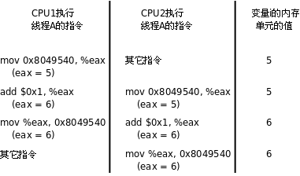

# 第 35 章 线程

## 1. 线程的概念

我们知道，进程在各自独立的地址空间中运行，进程之间共享数据需要用`mmap`或者进程间通信机制，本节我们学习如何在一个进程的地址空间中执行多个线程。有些情况需要在一个进程中同时执行多个控制流程，这时候线程就派上了用场，比如实现一个图形界面的下载软件，一方面需要和用户交互，等待和处理用户的鼠标键盘事件，另一方面又需要同时下载多个文件，等待和处理从多个网络主机发来的数据，这些任务都需要一个“等待-处理”的循环，可以用多线程实现，一个线程专门负责与用户交互，另外几个线程每个线程负责和一个网络主机通信。

以前我们讲过，`main`函数和信号处理函数是同一个进程地址空间中的多个控制流程，多线程也是如此，但是比信号处理函数更加灵活，信号处理函数的控制流程只是在信号递达时产生，在处理完信号之后就结束，而多线程的控制流程可以长期并存，操作系统会在各线程之间调度和切换，就像在多个进程之间调度和切换一样。由于同一进程的多个线程共享同一地址空间，因此Text  Segment、Data  Segment都是共享的，如果定义一个函数，在各线程中都可以调用，如果定义一个全局变量，在各线程中都可以访问到，除此之外，各线程还共享以下进程资源和环境：

- 文件描述符表
- 每种信号的处理方式（`SIG_IGN`、`SIG_DFL`或者自定义的信号处理函数）
- 当前工作目录
- 用户id和组id

但有些资源是每个线程各有一份的：

- 线程id
- 上下文，包括各种寄存器的值、程序计数器和栈指针
- 栈空间
- `errno`变量
- 信号屏蔽字
- 调度优先级

我们将要学习的线程库函数是由POSIX标准定义的，称为POSIX thread或者pthread。在Linux上线程函数位于`libpthread`共享库中，因此在编译时要加上`-lpthread`选项。

## 2. 线程控制

### 2.1. 创建线程

```
#include <pthread.h>

int pthread_create(pthread_t *restrict thread,
	const pthread_attr_t *restrict attr,
	void *(*start_routine)(void*), void *restrict arg);
```

返回值：成功返回0，失败返回错误号。以前学过的系统函数都是成功返回0，失败返回-1，而错误号保存在全局变量`errno`中，而pthread库的函数都是通过返回值返回错误号，虽然每个线程也都有一个`errno`，但这是为了兼容其它函数接口而提供的，pthread库本身并不使用它，通过返回值返回错误码更加清晰。

在一个线程中调用pthread_create()创建新的线程后，当前线程从pthread_create()返回继续往下执行，而新的线程所执行的代码由我们传给`pthread_create`的函数指针`start_routine`决定。`start_routine`函数接收一个参数，是通过`pthread_create`的`arg`参数传递给它的，该参数的类型为`void *`，这个指针按什么类型解释由调用者自己定义。`start_routine`的返回值类型也是`void *`，这个指针的含义同样由调用者自己定义。`start_routine`返回时，这个线程就退出了，其它线程可以调用`pthread_join`得到`start_routine`的返回值，类似于父进程调用`wait(2)`得到子进程的退出状态，稍后详细介绍`pthread_join`。

`pthread_create`成功返回后，新创建的线程的id被填写到`thread`参数所指向的内存单元。我们知道进程id的类型是`pid_t`，每个进程的id在整个系统中是唯一的，调用`getpid(2)`可以获得当前进程的id，是一个正整数值。线程id的类型是`thread_t`，它只在当前进程中保证是唯一的，在不同的系统中`thread_t`这个类型有不同的实现，它可能是一个整数值，也可能是一个结构体，也可能是一个地址，所以不能简单地当成整数用`printf`打印，调用`pthread_self(3)`可以获得当前线程的id。

`attr`参数表示线程属性，本章不深入讨论线程属性，所有代码例子都传`NULL`给`attr`参数，表示线程属性取缺省值，感兴趣的读者可以参考[[APUE2e\]](bi01.html#bibli.apue)。首先看一个简单的例子：

```
#include <stdio.h>
#include <string.h>
#include <stdlib.h>
#include <pthread.h>
#include <unistd.h>

pthread_t ntid;

void printids(const char *s)
{
	pid_t      pid;
	pthread_t  tid;

	pid = getpid();
	tid = pthread_self();
	printf("%s pid %u tid %u (0x%x)\n", s, (unsigned int)pid,
	       (unsigned int)tid, (unsigned int)tid);
}

void *thr_fn(void *arg)
{
	printids(arg);
	return NULL;
}

int main(void)
{
	int err;

	err = pthread_create(&ntid, NULL, thr_fn, "new thread: ");
	if (err != 0) {
		fprintf(stderr, "can't create thread: %s\n", strerror(err));
		exit(1);
	}
	printids("main thread:");
	sleep(1);

	return 0;
}
```

编译运行结果如下：

```
$ gcc main.c -lpthread
$ ./a.out
main thread: pid 7398 tid 3084450496 (0xb7d8fac0)
new thread:  pid 7398 tid 3084446608 (0xb7d8eb90)
```

可知在Linux上，`thread_t`类型是一个地址值，属于同一进程的多个线程调用`getpid(2)`可以得到相同的进程号，而调用`pthread_self(3)`得到的线程号各不相同。

由于`pthread_create`的错误码不保存在`errno`中，因此不能直接用`perror(3)`打印错误信息，可以先用`strerror(3)`把错误码转换成错误信息再打印。

如果任意一个线程调用了`exit`或`_exit`，则整个进程的所有线程都终止，由于从`main`函数`return`也相当于调用`exit`，为了防止新创建的线程还没有得到执行就终止，我们在`main`函数`return`之前延时1秒，这只是一种权宜之计，即使主线程等待1秒，内核也不一定会调度新创建的线程执行，下一节我们会看到更好的办法。

思考题：主线程在一个全局变量`ntid`中保存了新创建的线程的id，如果新创建的线程不调用`pthread_self`而是直接打印这个`ntid`，能不能达到同样的效果？

### 2.2. 终止线程

如果需要只终止某个线程而不终止整个进程，可以有三种方法：

- 从线程函数`return`。这种方法对主线程不适用，从`main`函数`return`相当于调用`exit`。
- 一个线程可以调用`pthread_cancel`终止同一进程中的另一个线程。
- 线程可以调用`pthread_exit`终止自己。

用`pthread_cancel`终止一个线程分同步和异步两种情况，比较复杂，本章不打算详细介绍，读者可以参考[[APUE2e\]](bi01.html#bibli.apue)。下面介绍`pthread_exit`的和`pthread_join`的用法。

```
#include <pthread.h>

void pthread_exit(void *value_ptr);
```

`value_ptr`是`void *`类型，和线程函数返回值的用法一样，其它线程可以调用`pthread_join`获得这个指针。

需要注意，`pthread_exit`或者`return`返回的指针所指向的内存单元必须是全局的或者是用`malloc`分配的，不能在线程函数的栈上分配，因为当其它线程得到这个返回指针时线程函数已经退出了。

```
#include <pthread.h>

int pthread_join(pthread_t thread, void **value_ptr);
```

返回值：成功返回0，失败返回错误号

调用该函数的线程将挂起等待，直到id为`thread`的线程终止。`thread`线程以不同的方法终止，通过`pthread_join`得到的终止状态是不同的，总结如下：

- 如果`thread`线程通过`return`返回，`value_ptr`所指向的单元里存放的是`thread`线程函数的返回值。
- 如果`thread`线程被别的线程调用`pthread_cancel`异常终止掉，`value_ptr`所指向的单元里存放的是常数`PTHREAD_CANCELED`。
- 如果`thread`线程是自己调用`pthread_exit`终止的，`value_ptr`所指向的单元存放的是传给`pthread_exit`的参数。

如果对`thread`线程的终止状态不感兴趣，可以传`NULL`给`value_ptr`参数。

看下面的例子（省略了出错处理）：

```
#include <stdio.h>
#include <stdlib.h>
#include <pthread.h>
#include <unistd.h>

void *thr_fn1(void *arg)
{
	printf("thread 1 returning\n");
	return (void *)1;
}

void *thr_fn2(void *arg)
{
	printf("thread 2 exiting\n");
	pthread_exit((void *)2);
}

void *thr_fn3(void *arg)
{
	while(1) {
		printf("thread 3 writing\n");
		sleep(1);
	}
}

int main(void)
{
	pthread_t   tid;
	void        *tret;

	pthread_create(&tid, NULL, thr_fn1, NULL);
	pthread_join(tid, &tret);
	printf("thread 1 exit code %d\n", (int)tret);

	pthread_create(&tid, NULL, thr_fn2, NULL);
	pthread_join(tid, &tret);
	printf("thread 2 exit code %d\n", (int)tret);

	pthread_create(&tid, NULL, thr_fn3, NULL);
	sleep(3);
	pthread_cancel(tid);
	pthread_join(tid, &tret);
	printf("thread 3 exit code %d\n", (int)tret);

	return 0;
}
```

运行结果是：

```
$ ./a.out 
thread 1 returning
thread 1 exit code 1
thread 2 exiting
thread 2 exit code 2
thread 3 writing
thread 3 writing
thread 3 writing
thread 3 exit code -1
```

可见在Linux的pthread库中常数`PTHREAD_CANCELED`的值是-1。可以在头文件`pthread.h`中找到它的定义：

```
#define PTHREAD_CANCELED ((void *) -1)
```

一般情况下，线程终止后，其终止状态一直保留到其它线程调用`pthread_join`获取它的状态为止。但是线程也可以被置为detach状态，这样的线程一旦终止就立刻回收它占用的所有资源，而不保留终止状态。不能对一个已经处于detach状态的线程调用`pthread_join`，这样的调用将返回`EINVAL`。对一个尚未detach的线程调用`pthread_join`或`pthread_detach`都可以把该线程置为detach状态，也就是说，不能对同一线程调用两次`pthread_join`，或者如果已经对一个线程调用了`pthread_detach`就不能再调用`pthread_join`了。

```
#include <pthread.h>

int pthread_detach(pthread_t tid);
```

返回值：成功返回0，失败返回错误号。

## 3. 线程间同步

### 3.1. mutex

多个线程同时访问共享数据时可能会冲突，这跟前面讲信号时所说的可重入性是同样的问题。比如两个线程都要把某个全局变量增加1，这个操作在某平台需要三条指令完成：

1. 从内存读变量值到寄存器
2. 寄存器的值加1
3. 将寄存器的值写回内存

假设两个线程在多处理器平台上同时执行这三条指令，则可能导致下图所示的结果，最后变量只加了一次而非两次。


**图 35.1. 并行访问冲突**



思考一下，如果这两个线程在单处理器平台上执行，能够避免这样的问题吗？

我们通过一个简单的程序观察这一现象。上图所描述的现象从理论上是存在这种可能的，但实际运行程序时很难观察到，为了使现象更容易观察到，我们把上述三条指令做的事情用更多条指令来做：

```
		val = counter;
		printf("%x: %d\n", (unsigned int)pthread_self(), val + 1);
		counter = val + 1;
```

我们在“读取变量的值”和“把变量的新值保存回去”这两步操作之间插入一个`printf`调用，它会执行`write`系统调用进内核，为内核调度别的线程执行提供了一个很好的时机。我们在一个循环中重复上述操作几千次，就会观察到访问冲突的现象。

```
#include <stdio.h>
#include <stdlib.h>
#include <pthread.h>

#define NLOOP 5000

int counter;                /* incremented by threads */

void *doit(void *);

int main(int argc, char **argv)
{
	pthread_t tidA, tidB;

	pthread_create(&tidA, NULL, &doit, NULL);
	pthread_create(&tidB, NULL, &doit, NULL);

        /* wait for both threads to terminate */
	pthread_join(tidA, NULL);
	pthread_join(tidB, NULL);

	return 0;
}

void *doit(void *vptr)
{
	int    i, val;

	/*
	 * Each thread fetches, prints, and increments the counter NLOOP times.
	 * The value of the counter should increase monotonically.
	 */

	for (i = 0; i < NLOOP; i++) {
		val = counter;
		printf("%x: %d\n", (unsigned int)pthread_self(), val + 1);
		counter = val + 1;
	}

	return NULL;
}
```

我们创建两个线程，各自把`counter`增加5000次，正常情况下最后`counter`应该等于10000，但事实上每次运行该程序的结果都不一样，有时候数到5000多，有时候数到6000多。

```
$ ./a.out
b76acb90: 1
b76acb90: 2
b76acb90: 3
b76acb90: 4
b76acb90: 5
b7eadb90: 1
b7eadb90: 2
b7eadb90: 3
b7eadb90: 4
b7eadb90: 5
b76acb90: 6
b76acb90: 7
b7eadb90: 6
b76acb90: 8
...
```

对于多线程的程序，访问冲突的问题是很普遍的，解决的办法是引入互斥锁（Mutex，Mutual Exclusive Lock），获得锁的线程可以完成“读-修改-写”的操作，然后释放锁给其它线程，没有获得锁的线程只能等待而不能访问共享数据，这样“读-修改-写”三步操作组成一个原子操作，要么都执行，要么都不执行，不会执行到中间被打断，也不会在其它处理器上并行做这个操作。

Mutex用`pthread_mutex_t`类型的变量表示，可以这样初始化和销毁：

```
#include <pthread.h>

int pthread_mutex_destroy(pthread_mutex_t *mutex);
int pthread_mutex_init(pthread_mutex_t *restrict mutex,
       const pthread_mutexattr_t *restrict attr);
pthread_mutex_t mutex = PTHREAD_MUTEX_INITIALIZER;
```

返回值：成功返回0，失败返回错误号。

`pthread_mutex_init`函数对Mutex做初始化，参数`attr`设定Mutex的属性，如果`attr`为`NULL`则表示缺省属性，本章不详细介绍Mutex属性，感兴趣的读者可以参考[[APUE2e\]](bi01.html#bibli.apue)。用`pthread_mutex_init`函数初始化的Mutex可以用`pthread_mutex_destroy`销毁。如果Mutex变量是静态分配的（全局变量或`static`变量），也可以用宏定义`PTHREAD_MUTEX_INITIALIZER`来初始化，相当于用`pthread_mutex_init`初始化并且`attr`参数为`NULL`。Mutex的加锁和解锁操作可以用下列函数：

```
#include <pthread.h>

int pthread_mutex_lock(pthread_mutex_t *mutex);
int pthread_mutex_trylock(pthread_mutex_t *mutex);
int pthread_mutex_unlock(pthread_mutex_t *mutex);
```

返回值：成功返回0，失败返回错误号。

一个线程可以调用pthread_mutex_lock获得Mutex，如果这时另一个线程已经调用pthread_mutex_lock获得了该Mutex，则当前线程需要挂起等待，直到另一个线程调用pthread_mutex_unlock释放Mutex，当前线程被唤醒，才能获得该Mutex并继续执行。

如果一个线程既想获得锁，又不想挂起等待，可以调用pthread_mutex_trylock，如果Mutex已经被另一个线程获得，这个函数会失败返回EBUSY，而不会使线程挂起等待。

现在我们用Mutex解决先前的问题：

```
#include <stdio.h>
#include <stdlib.h>
#include <pthread.h>


#define NLOOP 5000

int counter;                /* incremented by threads */
pthread_mutex_t counter_mutex = PTHREAD_MUTEX_INITIALIZER;

void *doit(void *);

int main(int argc, char **argv)
{
	pthread_t tidA, tidB;

	pthread_create(&tidA, NULL, doit, NULL);
	pthread_create(&tidB, NULL, doit, NULL);

        /* wait for both threads to terminate */
	pthread_join(tidA, NULL);
	pthread_join(tidB, NULL);

	return 0;
}

void *doit(void *vptr)
{
	int     i, val;

	/*
	 * Each thread fetches, prints, and increments the counter NLOOP times.
	 * The value of the counter should increase monotonically.
	 */

	for (i = 0; i < NLOOP; i++) {
		pthread_mutex_lock(&counter_mutex);

		val = counter;
		printf("%x: %d\n", (unsigned int)pthread_self(), val + 1);
		counter = val + 1;

		pthread_mutex_unlock(&counter_mutex);
	}

	return NULL;
}
```

这样运行结果就正常了，每次运行都能数到10000。

看到这里，读者一定会好奇：Mutex的两个基本操作lock和unlock是如何实现的呢？假设Mutex变量的值为1表示互斥锁空闲，这时某个进程调用lock可以获得锁，而Mutex的值为0表示互斥锁已经被某个线程获得，其它线程再调用lock只能挂起等待。那么lock和unlock的伪代码如下：

```
lock:
	if(mutex > 0){
		mutex = 0;
		return 0;
	} else
		挂起等待;
	goto lock;

unlock:
	mutex = 1;
	唤醒等待Mutex的线程;
	return 0;
```

unlock操作中唤醒等待线程的步骤可以有不同的实现，可以只唤醒一个等待线程，也可以唤醒所有等待该Mutex的线程，然后让被唤醒的这些线程去竞争获得这个Mutex，竞争失败的线程继续挂起等待。

细心的读者应该已经看出问题了：对Mutex变量的读取、判断和修改不是原子操作。如果两个线程同时调用lock，这时Mutex是1，两个线程都判断mutex>0成立，然后其中一个线程置mutex=0，而另一个线程并不知道这一情况，也置mutex=0，于是两个线程都以为自己获得了锁。

为了实现互斥锁操作，大多数体系结构都提供了swap或exchange指令，该指令的作用是把寄存器和内存单元的数据相交换，由于只有一条指令，保证了原子性，即使是多处理器平台，访问内存的总线周期也有先后，一个处理器上的交换指令执行时另一个处理器的交换指令只能等待总线周期。现在我们把lock和unlock的伪代码改一下（以x86的xchg指令为例）：

```
lock:
	movb $0, %al
	xchgb %al, mutex
	if(al寄存器的内容 > 0){
		return 0;
	} else
		挂起等待;
	goto lock;

unlock:
	movb $1, mutex
	唤醒等待Mutex的线程;
	return 0;
```

unlock中的释放锁操作同样只用一条指令实现，以保证它的原子性。

也许还有读者好奇，“挂起等待”和“唤醒等待线程”的操作如何实现？每个Mutex有一个等待队列，一个线程要在Mutex上挂起等待，首先在把自己加入等待队列中，然后置线程状态为睡眠，然后调用调度器函数切换到别的线程。一个线程要唤醒等待队列中的其它线程，只需从等待队列中取出一项，把它的状态从睡眠改为就绪，加入就绪队列，那么下次调度器函数执行时就有可能切换到被唤醒的线程。

一般情况下，如果同一个线程先后两次调用lock，在第二次调用时，由于锁已经被占用，该线程会挂起等待别的线程释放锁，然而锁正是被自己占用着的，该线程又被挂起而没有机会释放锁，因此就永远处于挂起等待状态了，这叫做死锁（Deadlock）。另一种典型的死锁情形是这样：线程A获得了锁1，线程B获得了锁2，这时线程A调用lock试图获得锁2，结果是需要挂起等待线程B释放锁2，而这时线程B也调用lock试图获得锁1，结果是需要挂起等待线程A释放锁1，于是线程A和B都永远处于挂起状态了。不难想象，如果涉及到更多的线程和更多的锁，有没有可能死锁的问题将会变得复杂和难以判断。

写程序时应该尽量避免同时获得多个锁，如果一定有必要这么做，则有一个原则：如果所有线程在需要多个锁时都按相同的先后顺序（常见的是按Mutex变量的地址顺序）获得锁，则不会出现死锁。比如一个程序中用到锁1、锁2、锁3，它们所对应的Mutex变量的地址是锁1<锁2<锁3，那么所有线程在需要同时获得2个或3个锁时都应该按锁1、锁2、锁3的顺序获得。如果要为所有的锁确定一个先后顺序比较困难，则应该尽量使用pthread_mutex_trylock调用代替pthread_mutex_lock调用，以免死锁。

### 3.2. Condition Variable

线程间的同步还有这样一种情况：线程A需要等某个条件成立才能继续往下执行，现在这个条件不成立，线程A就阻塞等待，而线程B在执行过程中使这个条件成立了，就唤醒线程A继续执行。在pthread库中通过条件变量（Condition Variable）来阻塞等待一个条件，或者唤醒等待这个条件的线程。Condition Variable用`pthread_cond_t`类型的变量表示，可以这样初始化和销毁：

```
#include <pthread.h>

int pthread_cond_destroy(pthread_cond_t *cond);
int pthread_cond_init(pthread_cond_t *restrict cond,
       const pthread_condattr_t *restrict attr);
pthread_cond_t cond = PTHREAD_COND_INITIALIZER;
```

返回值：成功返回0，失败返回错误号。

和Mutex的初始化和销毁类似，`pthread_cond_init`函数初始化一个Condition Variable，`attr`参数为`NULL`则表示缺省属性，`pthread_cond_destroy`函数销毁一个Condition Variable。如果Condition Variable是静态分配的，也可以用宏定义`PTHEAD_COND_INITIALIZER`初始化，相当于用`pthread_cond_init`函数初始化并且`attr`参数为`NULL`。Condition Variable的操作可以用下列函数：

```
#include <pthread.h>

int pthread_cond_timedwait(pthread_cond_t *restrict cond,
       pthread_mutex_t *restrict mutex,
       const struct timespec *restrict abstime);
int pthread_cond_wait(pthread_cond_t *restrict cond,
       pthread_mutex_t *restrict mutex);
int pthread_cond_broadcast(pthread_cond_t *cond);
int pthread_cond_signal(pthread_cond_t *cond);
```

返回值：成功返回0，失败返回错误号。

可见，一个Condition Variable总是和一个Mutex搭配使用的。一个线程可以调用`pthread_cond_wait`在一个Condition Variable上阻塞等待，这个函数做以下三步操作：

1. 释放Mutex
2. 阻塞等待
3. 当被唤醒时，重新获得Mutex并返回

`pthread_cond_timedwait`函数还有一个额外的参数可以设定等待超时，如果到达了`abstime`所指定的时刻仍然没有别的线程来唤醒当前线程，就返回`ETIMEDOUT`。一个线程可以调用`pthread_cond_signal`唤醒在某个Condition Variable上等待的另一个线程，也可以调用`pthread_cond_broadcast`唤醒在这个Condition Variable上等待的所有线程。

下面的程序演示了一个生产者-消费者的例子，生产者生产一个结构体串在链表的表头上，消费者从表头取走结构体。

```
#include <stdlib.h>
#include <pthread.h>
#include <stdio.h>

struct msg {
	struct msg *next;
	int num;
};

struct msg *head;
pthread_cond_t has_product = PTHREAD_COND_INITIALIZER;
pthread_mutex_t lock = PTHREAD_MUTEX_INITIALIZER;

void *consumer(void *p)
{
	struct msg *mp;

	for (;;) {
		pthread_mutex_lock(&lock);
		while (head == NULL)
			pthread_cond_wait(&has_product, &lock);
		mp = head;
		head = mp->next;
		pthread_mutex_unlock(&lock);
		printf("Consume %d\n", mp->num);
		free(mp);
		sleep(rand() % 5);
	}
}

void *producer(void *p)
{
	struct msg *mp;
	for (;;) {
		mp = malloc(sizeof(struct msg));
		mp->num = rand() % 1000 + 1;
		printf("Produce %d\n", mp->num);
		pthread_mutex_lock(&lock);
		mp->next = head;
		head = mp;
		pthread_mutex_unlock(&lock);
		pthread_cond_signal(&has_product);
		sleep(rand() % 5);
	}
}

int main(int argc, char *argv[]) 
{
	pthread_t pid, cid;  

	srand(time(NULL));
	pthread_create(&pid, NULL, producer, NULL);
	pthread_create(&cid, NULL, consumer, NULL);
	pthread_join(pid, NULL);
	pthread_join(cid, NULL);
	return 0;
}
```

执行结果如下：

```
$ ./a.out 
Produce 744
Consume 744
Produce 567
Produce 881
Consume 881
Produce 911
Consume 911
Consume 567
Produce 698
Consume 698
```

#### 习题

1、在本节的例子中，生产者和消费者访问链表的顺序是LIFO的，请修改程序，把访问顺序改成FIFO。

### 3.3. Semaphore

Mutex变量是非0即1的，可看作一种资源的可用数量，初始化时Mutex是1，表示有一个可用资源，加锁时获得该资源，将Mutex减到0，表示不再有可用资源，解锁时释放该资源，将Mutex重新加到1，表示又有了一个可用资源。

信号量（Semaphore）和Mutex类似，表示可用资源的数量，和Mutex不同的是这个数量可以大于1。

本节介绍的是POSIX semaphore库函数，详见sem_overview(7)，这种信号量不仅可用于同一进程的线程间同步，也可用于不同进程间的同步。

```
#include <semaphore.h>

int sem_init(sem_t *sem, int pshared, unsigned int value);
int sem_wait(sem_t *sem);
int sem_trywait(sem_t *sem);
int sem_post(sem_t * sem);
int sem_destroy(sem_t * sem);
```

semaphore变量的类型为sem_t，sem_init()初始化一个semaphore变量，value参数表示可用资源的数量，pshared参数为0表示信号量用于同一进程的线程间同步，本节只介绍这种情况。在用完semaphore变量之后应该调用sem_destroy()释放与semaphore相关的资源。

调用sem_wait()可以获得资源，使semaphore的值减1，如果调用sem_wait()时semaphore的值已经是0，则挂起等待。如果不希望挂起等待，可以调用sem_trywait()。调用sem_post()可以释放资源，使semaphore的值加1，同时唤醒挂起等待的线程。

上一节生产者－消费者的例子是基于链表的，其空间可以动态分配，现在基于固定大小的环形队列重写这个程序：

```
#include <stdlib.h>
#include <pthread.h>
#include <stdio.h>
#include <semaphore.h>

#define NUM 5
int queue[NUM];
sem_t blank_number, product_number;

void *producer(void *arg) 
{
	int p = 0;
	while (1) {
		sem_wait(&blank_number);
		queue[p] = rand() % 1000 + 1;
		printf("Produce %d\n", queue[p]);
		sem_post(&product_number);
		p = (p+1)%NUM;
		sleep(rand()%5);
	}
}

void *consumer(void *arg) 
{
	int c = 0;
	while (1) {
		sem_wait(&product_number);
		printf("Consume %d\n", queue[c]);
		queue[c] = 0;
		sem_post(&blank_number);
		c = (c+1)%NUM;
		sleep(rand()%5);
	}
}

int main(int argc, char *argv[]) 
{
	pthread_t pid, cid;  

	sem_init(&blank_number, 0, NUM);
	sem_init(&product_number, 0, 0);
	pthread_create(&pid, NULL, producer, NULL);
	pthread_create(&cid, NULL, consumer, NULL);
	pthread_join(pid, NULL);
	pthread_join(cid, NULL);
	sem_destroy(&blank_number);
	sem_destroy(&product_number);
	return 0;
}
```

#### 习题

1、本节和上一节的例子给出一个重要的提示：用Condition Variable可以实现Semaphore。请用Condition Variable实现Semaphore，然后用自己实现的Semaphore重写本节的程序。

### 3.4. 其它线程间同步机制

如果共享数据是只读的，那么各线程读到的数据应该总是一致的，不会出现访问冲突。只要有一个线程可以改写数据，就必须考虑线程间同步的问题。由此引出了读者写者锁（Reader-Writer   Lock）的概念，Reader之间并不互斥，可以同时读共享数据，而Writer是独占的（exclusive），在Writer修改数据时其它Reader或Writer不能访问数据，可见Reader-Writer  Lock比Mutex具有更好的并发性。

用挂起等待的方式解决访问冲突不见得是最好的办法，因为这样毕竟会影响系统的并发性，在某些情况下解决访问冲突的问题可以尽量避免挂起某个线程，例如Linux内核的Seqlock、RCU（read-copy-update）等机制。

关于这些同步机制的细节，有兴趣的读者可以参考[[APUE2e\]](bi01.html#bibli.apue)和[[ULK\]](bi01.html#bibli.ulk)。

## 4. 编程练习

哲学家就餐问题。这是由计算机科学家Dijkstra提出的经典死锁场景。

原版的故事里有五个哲学家(不过我们写的程序可以有N个哲学家)，这些哲学家们只做两件事－－思考和吃饭，他们思考的时候不需要任何共享资源，但是吃饭的时候就必须使用餐具，而餐桌上的餐具是有限的，原版的故事里，餐具是叉子，吃饭的时候要用两把叉子把面条从碗里捞出来。很显然把叉子换成筷子会更合理，所以：一个哲学家需要两根筷子才能吃饭。

现在引入问题的关键：这些哲学家很穷，只买得起五根筷子。他们坐成一圈，两个人的中间放一根筷子。哲学家吃饭的时候必须同时得到左手边和右手边的筷子。如果他身边的任何一位正在使用筷子，那他只有等着。

假设哲学家的编号是A、B、C、D、E，筷子编号是1、2、3、4、5，哲学家和筷子围成一圈如下图所示：


**图 35.2. 哲学家问题**


每个哲学家都是一个单独的线程，每个线程循环做以下动作：思考rand()%10秒，然后先拿左手边的筷子再拿右手边的筷子（筷子这种资源可以用mutex表示），有任何一边拿不到就一直等着，全拿到就吃饭rand()%10秒，然后放下筷子。

编写程序仿真哲学家就餐的场景：

```
Philosopher A fetches chopstick 5
Philosopher B fetches chopstick 1
Philosopher B fetches chopstick 2
Philosopher D fetches chopstick 3
Philosopher B releases chopsticks 1 2
Philosopher A fetches chopstick 1
Philosopher C fetches chopstick 2
Philosopher A releases chopsticks 5 1
...
```

分析一下，这个过程有没有可能产生死锁？调用usleep(3)函数可以实现微秒级的延时，试着用usleep(3)加快仿真的速度，看能不能观察到死锁现象。然后修改上述算法避免产生死锁。 