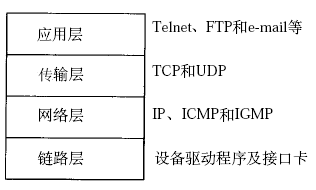
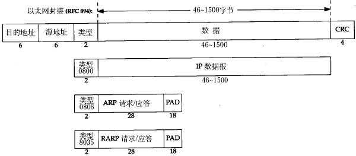
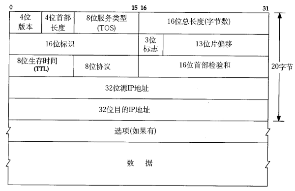
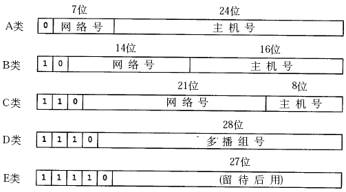
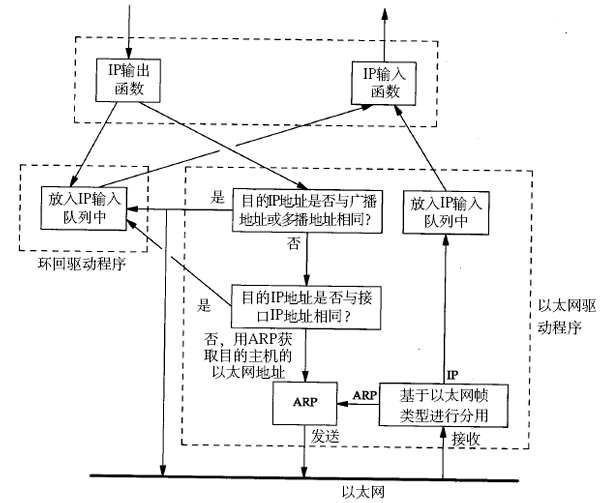
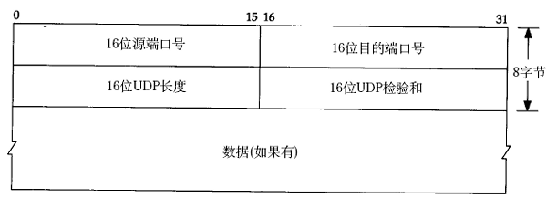
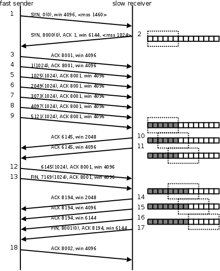

# 第 36 章 TCP/IP 协议基础

## 1. TCP/IP协议栈与数据包封装

TCP/IP网络协议栈分为应用层（Application）、传输层（Transport）、网络层（Network）和链路层（Link）四层。如下图所示（该图出自[[TCPIP\]](bi01.html#bibli.tcpip)）。

**图 36.1. TCP/IP协议栈**



两台计算机通过TCP/IP协议通讯的过程如下所示（该图出自[[TCPIP\]](bi01.html#bibli.tcpip)）。

**图 36.2. TCP/IP通讯过程**


传输层及其以下的机制由内核提供，应用层由用户进程提供（后面将介绍如何使用socket   API编写应用程序），应用程序对通讯数据的含义进行解释，而传输层及其以下处理通讯的细节，将数据从一台计算机通过一定的路径发送到另一台计算机。应用层数据通过协议栈发到网络上时，每层协议都要加上一个数据首部（header），称为封装（Encapsulation），如下图所示（该图出自[[TCPIP\]](bi01.html#bibli.tcpip)）。

**图 36.3. TCP/IP数据包的封装**


不同的协议层对数据包有不同的称谓，在传输层叫做段（segment），在网络层叫做数据报（datagram），在链路层叫做帧（frame）。数据封装成帧后发到传输介质上，到达目的主机后每层协议再剥掉相应的首部，最后将应用层数据交给应用程序处理。

上图对应两台计算机在同一网段中的情况，如果两台计算机在不同的网段中，那么数据从一台计算机到另一台计算机传输过程中要经过一个或多个路由器，如下图所示（该图出自[[TCPIP\]](bi01.html#bibli.tcpip)）。

**图 36.4. 跨路由器通讯过程**


其实在链路层之下还有物理层，指的是电信号的传递方式，比如现在以太网通用的网线（双绞线）、早期以太网采用的的同轴电缆（现在主要用于有线电视）、光纤等都属于物理层的概念。物理层的能力决定了最大传输速率、传输距离、抗干扰性等。集线器（Hub）是工作在物理层的网络设备，用于双绞线的连接和信号中继（将已衰减的信号再次放大使之传得更远）。

链路层有以太网、令牌环网等标准，链路层负责网卡设备的驱动、帧同步（就是说从网线上检测到什么信号算作新帧的开始）、冲突检测（如果检测到冲突就自动重发）、数据差错校验等工作。交换机是工作在链路层的网络设备，可以在不同的链路层网络之间转发数据帧（比如十兆以太网和百兆以太网之间、以太网和令牌环网之间），由于不同链路层的帧格式不同，交换机要将进来的数据包拆掉链路层首部重新封装之后再转发。

网络层的IP协议是构成Internet的基础。Internet上的主机通过IP地址来标识，Internet上有大量路由器负责根据IP地址选择合适的路径转发数据包，数据包从Internet上的源主机到目的主机往往要经过十多个路由器。路由器是工作在第三层的网络设备，同时兼有交换机的功能，可以在不同的链路层接口之间转发数据包，因此路由器需要将进来的数据包拆掉网络层和链路层两层首部并重新封装。IP协议不保证传输的可靠性，数据包在传输过程中可能丢失，可靠性可以在上层协议或应用程序中提供支持。

网络层负责点到点（point-to-point）的传输（这里的「点」指主机或路由器），而传输层负责端到端（end-to-end）的传输（这里的「端」指源主机和目的主机）。传输层可选择TCP或UDP协议。TCP是一种面向连接的、可靠的协议，有点像打电话，双方拿起电话互通身份之后就建立了连接，然后说话就行了，这边说的话那边保证听得到，并且是按说话的顺序听到的，说完话挂机断开连接。也就是说TCP传输的双方需要首先建立连接，之后由TCP协议保证数据收发的可靠性，丢失的数据包自动重发，上层应用程序收到的总是可靠的数据流，通讯之后关闭连接。UDP协议不面向连接，也不保证可靠性，有点像寄信，写好信放到邮筒里，既不能保证信件在邮递过程中不会丢失，也不能保证信件是按顺序寄到目的地的。使用UDP协议的应用程序需要自己完成丢包重发、消息排序等工作。

目的主机收到数据包后，如何经过各层协议栈最后到达应用程序呢？整个过程如下图所示（该图出自[[TCPIP\]](bi01.html#bibli.tcpip)）。

**图 36.5. Multiplexing过程**


以太网驱动程序首先根据以太网首部中的「上层协议」字段确定该数据帧的有效载荷（payload，指除去协议首部之外实际传输的数据）是IP、ARP还是RARP协议的数据报，然后交给相应的协议处理。假如是IP数据报，IP协议再根据IP首部中的「上层协议」字段确定该数据报的有效载荷是TCP、UDP、ICMP还是IGMP，然后交给相应的协议处理。假如是TCP段或UDP段，TCP或UDP协议再根据TCP首部或UDP首部的「端口号」字段确定应该将应用层数据交给哪个用户进程。IP地址是标识网络中不同主机的地址，而端口号就是同一台主机上标识不同进程的地址，IP地址和端口号合起来标识网络中唯一的进程。

注意，虽然IP、ARP和RARP数据报都需要以太网驱动程序来封装成帧，但是从功能上划分，ARP和RARP属于链路层，IP属于网络层。虽然ICMP、IGMP、TCP、UDP的数据都需要IP协议来封装成数据报，但是从功能上划分，ICMP、IGMP与IP同属于网络层，TCP和UDP属于传输层。本文对RARP、ICMP、IGMP协议不做进一步介绍，有兴趣的读者可以看参考资料。

## 2. 以太网(RFC 894)帧格式

以太网的帧格式如下所示（该图出自[[TCPIP\]](bi01.html#bibli.tcpip)）：

**图 36.6. 以太网帧格式**



其中的源地址和目的地址是指网卡的硬件地址（也叫MAC地址），长度是48位，是在网卡出厂时固化的。用ifconfig命令看一下，「HWaddr  00:15:F2:14:9E:3F」部分就是硬件地址。协议字段有三种值，分别对应IP、ARP、RARP。帧末尾是CRC校验码。

以太网帧中的数据长度规定最小46字节，最大1500字节，ARP和RARP数据包的长度不够46字节，要在后面补填充位。最大值1500称为以太网的最大传输单元（MTU），不同的网络类型有不同的MTU，如果一个数据包从以太网路由到拨号链路上，数据包长度大于拨号链路的MTU了，则需要对数据包进行分片（fragmentation）。ifconfig命令的输出中也有「MTU:1500」。注意，MTU这个概念指数据帧中有效载荷的最大长度，不包括帧首部的长度。

## 3. ARP数据报格式

在网络通讯时，源主机的应用程序知道目的主机的IP地址和端口号，却不知道目的主机的硬件地址，而数据包首先是被网卡接收到再去处理上层协议的，如果接收到的数据包的硬件地址与本机不符，则直接丢弃。因此在通讯前必须获得目的主机的硬件地址。ARP协议就起到这个作用。源主机发出ARP请求，询问「IP地址是192.168.0.1的主机的硬件地址是多少」，并将这个请求广播到本地网段（以太网帧首部的硬件地址填FF:FF:FF:FF:FF:FF表示广播），目的主机接收到广播的ARP请求，发现其中的IP地址与本机相符，则发送一个ARP应答数据包给源主机，将自己的硬件地址填写在应答包中。

每台主机都维护一个ARP缓存表，可以用arp -a命令查看。缓存表中的表项有过期时间（一般为20分钟），如果20分钟内没有再次使用某个表项，则该表项失效，下次还要发ARP请求来获得目的主机的硬件地址。想一想，为什么表项要有过期时间而不是一直有效？

ARP数据报的格式如下所示（该图出自[[TCPIP\]](bi01.html#bibli.tcpip)）：

**图 36.7. ARP数据报格式**


注意到源MAC地址、目的MAC地址在以太网首部和ARP请求中各出现一次，对于链路层为以太网的情况是多余的，但如果链路层是其它类型的网络则有可能是必要的。硬件类型指链路层网络类型，1为以太网，协议类型指要转换的地址类型，0x0800为IP地址，后面两个地址长度对于以太网地址和IP地址分别为6和4（字节），op字段为1表示ARP请求，op字段为2表示ARP应答。

下面举一个具体的例子。

请求帧如下（为了清晰在每行的前面加了字节计数，每行16个字节）：

以太网首部（14字节）
 0000: ff ff ff ff ff ff 00 05 5d 61 58 a8 08 06
 ARP帧（28字节）
 0000:                                           00 01
 0010: 08 00 06 04 00 01 00 05 5d 61 58 a8 c0 a8 00 37
 0020: 00 00 00 00 00 00 c0 a8 00 02
 填充位（18字节）
 0020:                               00 77 31 d2 50 10
 0030: fd 78 41 d3 00 00 00 00 00 00 00 00

以太网首部：目的主机采用广播地址，源主机的MAC地址是00:05:5d:61:58:a8，上层协议类型0x0806表示ARP。

ARP帧：硬件类型0x0001表示以太网，协议类型0x0800表示IP协议，硬件地址（MAC地址）长度为6，协议地址（IP地址）长度为4，op为0x0001表示请求目的主机的MAC地址，源主机MAC地址为00:05:5d:61:58:a8，源主机IP地址为c0  a8 00 37（192.168.0.55），目的主机MAC地址全0待填写，目的主机IP地址为c0 a8 00  02（192.168.0.2）。

由于以太网规定最小数据长度为46字节，ARP帧长度只有28字节，因此有18字节填充位，填充位的内容没有定义，与具体实现相关。

应答帧如下：

以太网首部
 0000: 00 05 5d 61 58 a8 00 05 5d a1 b8 40 08 06
 ARP帧
 0000:                                           00 01
 0010: 08 00 06 04 00 02 00 05 5d a1 b8 40 c0 a8 00 02
 0020: 00 05 5d 61 58 a8 c0 a8 00 37
 填充位
 0020:                               00 77 31 d2 50 10
 0030: fd 78 41 d3 00 00 00 00 00 00 00 00

以太网首部：目的主机的MAC地址是00:05:5d:61:58:a8，源主机的MAC地址是00:05:5d:a1:b8:40，上层协议类型0x0806表示ARP。

ARP帧：硬件类型0x0001表示以太网，协议类型0x0800表示IP协议，硬件地址（MAC地址）长度为6，协议地址（IP地址）长度为4，op为0x0002表示应答，源主机MAC地址为00:05:5d:a1:b8:40，源主机IP地址为c0  a8 00 02（192.168.0.2），目的主机MAC地址为00:05:5d:61:58:a8，目的主机IP地址为c0 a8 00  37（192.168.0.55）。

### 思考题

如果源主机和目的主机不在同一网段，ARP请求的广播帧无法穿过路由器，源主机如何与目的主机通信？

## 4. IP数据报格式

IP数据报的格式如下（这里只讨论IPv4）（该图出自[[TCPIP\]](bi01.html#bibli.tcpip)）：

**图 36.8. IP数据报格式**



IP数据报的首部长度和数据长度都是可变长的，但总是4字节的整数倍。对于IPv4，4位版本字段是4。4位首部长度的数值是以4字节为单位的，最小值为5，也就是说首部长度最小是4x5=20字节，也就是不带任何选项的IP首部，4位能表示的最大值是15，也就是说首部长度最大是60字节。8位TOS字段有3个位用来指定IP数据报的优先级（目前已经废弃不用），还有4个位表示可选的服务类型（最小延迟、最大呑吐量、最大可靠性、最小成本），还有一个位总是0。总长度是整个数据报（包括IP首部和IP层payload）的字节数。每传一个IP数据报，16位的标识加1，可用于分片和重新组装数据报。3位标志和13位片偏移用于分片。TTL（Time  to  live)是这样用的：源主机为数据包设定一个生存时间，比如64，每过一个路由器就把该值减1，如果减到0就表示路由已经太长了仍然找不到目的主机的网络，就丢弃该包，因此这个生存时间的单位不是秒，而是跳（hop）。协议字段指示上层协议是TCP、UDP、ICMP还是IGMP。然后是校验和，只校验IP首部，数据的校验由更高层协议负责。IPv4的IP地址长度为32位。选项字段的解释从略。

想一想，前面讲了以太网帧中的最小数据长度为46字节，不足46字节的要用填充字节补上，那么如何界定这46字节里前多少个字节是IP、ARP或RARP数据报而后面是填充字节？

## 5. IP地址与路由

IPv4的IP地址长度为4字节，通常采用点分十进制表示法（dotted  decimal  representation）例如0xc0a80002表示为192.168.0.2。Internet被各种路由器和网关设备分隔成很多网段，为了标识不同的网段，需要把32位的IP地址划分成网络号和主机号两部分，网络号相同的各主机位于同一网段，相互间可以直接通信，网络号不同的主机之间通信则需要通过路由器转发。

过去曾经提出一种划分网络号和主机号的方案，把所有IP地址分为五类，如下图所示（该图出自[[TCPIP\]](bi01.html#bibli.tcpip)）。

**图 36.9. IP地址类**



A类 0.0.0.0到127.255.255.255
 B类 128.0.0.0到191.255.255.255
 C类 192.0.0.0到223.255.255.255
 D类 224.0.0.0到239.255.255.255
 E类 240.0.0.0到247.255.255.255

一个A类网络可容纳的地址数量最大，一个B类网络的地址数量是65536，一个C类网络的地址数量是256。D类地址用作多播地址，E类地址保留未用。

随着Internet的飞速发展，这种划分方案的局限性很快显现出来，大多数组织都申请B类网络地址，导致B类地址很快就分配完了，而A类却浪费了大量地址。这种方式对网络的划分是flat的而不是层级结构（hierarchical）的，Internet上的每个路由器都必须掌握所有网络的信息，随着大量C类网络的出现，路由器需要检索的路由表越来越庞大，负担越来越重。

针对这种情况提出了新的划分方案，称为CIDR（Classless  Interdomain Routing）。网络号和主机号的划分需要用一个额外的子网掩码（subnet  mask）来表示，而不能由IP地址本身的数值决定，也就是说，网络号和主机号的划分与这个IP地址是A类、B类还是C类无关，因此称为Classless的。这样，多个子网就可以汇总（summarize）成一个Internet上的网络，例如，有8个站点都申请了C类网络，本来网络号是24位的，但是这8个站点通过同一个ISP（Internet  service  provider）连到Internet上，它们网络号的高21位是相同的，只有低三位不同，这8个站点就可以汇总，在Internet上只需要一个路由表项，数据包通过Internet上的路由器到达ISP，然后在ISP这边再通过次级的路由器选路到某个站点。

下面举两个例子：

**表 36.1. 划分子网的例子1**

| IP地址       | 140.252.20.68               | 8C FC 14 44 |
| ------------ | --------------------------- | ----------- |
| 子网掩码     | 255.255.255.0               | FF FF FF 00 |
| 网络号       | 140.252.20.0                | 8C FC 14 00 |
| 子网地址范围 | 140.252.20.0~140.252.20.255 |             |

**表 36.2. 划分子网的例子2**

| IP地址       | 140.252.20.68               | 8C FC 14 44 |
| ------------ | --------------------------- | ----------- |
| 子网掩码     | 255.255.255.240             | FF FF FF F0 |
| 网络号       | 140.252.20.64               | 8C FC 14 40 |
| 子网地址范围 | 140.252.20.64~140.252.20.79 |             |

可见，IP地址与子网掩码做与运算可以得到网络号，主机号从全0到全1就是子网的地址范围。IP地址和子网掩码还有一种更简洁的表示方法，例如140.252.20.68/24，表示IP地址为140.252.20.68，子网掩码的高24位是1，也就是255.255.255.0。

如果一个组织内部组建局域网，IP地址只用于局域网内的通信，而不直接连到Internet上，理论上使用任意的IP地址都可以，但是RFC 1918规定了用于组建局域网的私有IP地址，这些地址不会出现在Internet上，如下表所示。

- 10.*，前8位是网络号，共16,777,216个地址
- 172.16.*到172.31.*，前12位是网络号，共1,048,576个地址
- 192.168.*，前16位是网络号，共65,536个地址

使用私有IP地址的局域网主机虽然没有Internet的IP地址，但也可以通过代理服务器或NAT（网络地址转换）等技术连到Internet上。

除了私有IP地址之外，还有几种特殊的IP地址。127.*的IP地址用于本机环回(loop   back)测试，通常是127.0.0.1。loopback是系统中一种特殊的网络设备，如果发送数据包的目的地址是环回地址，或者与本机其它网络设备的IP地址相同，则数据包不会发送到网络介质上，而是通过环回设备再发回给上层协议和应用程序，主要用于测试。如下图所示（该图出自[[TCPIP\]](bi01.html#bibli.tcpip)）。

**图 36.10. loopback设备**



还有一些不能用作主机IP地址的特殊地址：

- 目的地址为255.255.255.255，表示本网络内部广播，路由器不转发这样的广播数据包。
- 主机号全为0的地址只表示网络而不能表示某个主机，如192.168.10.0（假设子网掩码为255.255.255.0）。
- 目的地址的主机号为全1，表示广播至某个网络的所有主机，例如目的地址192.168.10.255表示广播至192.168.10.0网络（假设子网掩码为255.255.255.0）。

下面介绍路由的过程，首先正式定义几个名词：

- 路由（名词）

  数据包从源地址到目的地址所经过的路径，由一系列路由节点组成。

- 路由（动词）

  某个路由节点为数据报选择投递方向的选路过程。

- 路由节点

  一个具有路由能力的主机或路由器，它维护一张路由表，通过查询路由表来决定向哪个接口发送数据包。

- 接口

  路由节点与某个网络相连的网卡接口。

- 路由表

  由很多路由条目组成，每个条目都指明去往某个网络的数据包应该经由哪个接口发送，其中最后一条是缺省路由条目。

- 路由条目

  路由表中的一行，每个条目主要由目的网络地址、子网掩码、下一跳地址、发送接口四部分组成，如果要发送的数据包的目的网络地址匹配路由表中的某一行，就按规定的接口发送到下一跳地址。

- 缺省路由条目

  路由表中的最后一行，主要由下一跳地址和发送接口两部分组成，当目的地址与路由表中其它行都不匹配时，就按缺省路由条目规定的接口发送到下一跳地址。

假设某主机上的网络接口配置和路由表如下：

```
$ ifconfig
eth0      Link encap:Ethernet  HWaddr 00:0C:29:C2:8D:7E
          inet addr:192.168.10.223  Bcast:192.168.10.255  Mask:255.255.255.0
          UP BROADCAST RUNNING MULTICAST  MTU:1500  Metric:1
          RX packets:0 errors:0 dropped:0 overruns:0 frame:0
          TX packets:10 errors:0 dropped:0 overruns:0 carrier:0
          collisions:0 txqueuelen:100
          RX bytes:0 (0.0 b)  TX bytes:420 (420.0 b)
          Interrupt:10 Base address:0x10a0

eth1      Link encap:Ethernet  HWaddr 00:0C:29:C2:8D:88
          inet addr:192.168.56.136  Bcast:192.168.56.255  Mask:255.255.255.0
          UP BROADCAST RUNNING MULTICAST  MTU:1500  Metric:1
          RX packets:603 errors:0 dropped:0 overruns:0 frame:0
          TX packets:110 errors:0 dropped:0 overruns:0 carrier:0
          collisions:0 txqueuelen:100
          RX bytes:55551 (54.2 Kb)  TX bytes:7601 (7.4 Kb)
          Interrupt:9 Base address:0x10c0

lo        Link encap:Local Loopback  
          inet addr:127.0.0.1  Mask:255.0.0.0
          UP LOOPBACK RUNNING  MTU:16436  Metric:1
          RX packets:37 errors:0 dropped:0 overruns:0 frame:0
          TX packets:37 errors:0 dropped:0 overruns:0 carrier:0
          collisions:0 txqueuelen:0 
          RX bytes:3020 (2.9 Kb)  TX bytes:3020 (2.9 Kb)
$ route
Kernel IP routing table
Destination     Gateway         Genmask         Flags Metric Ref    Use Iface
192.168.10.0    *               255.255.255.0   U     0      0        0 eth0
192.168.56.0    *               255.255.255.0   U     0      0        0 eth1
127.0.0.0       *               255.0.0.0       U     0      0        0 lo
default         192.168.10.1    0.0.0.0         UG    0      0        0 eth0
```

这台主机有两个网络接口，一个网络接口连到192.168.10.0/24网络，另一个网络接口连到192.168.56.0/24网络。路由表的Destination是目的网络地址，Genmask是子网掩码，Gateway是下一跳地址，Iface是发送接口，Flags中的U标志表示此条目有效（可以禁用某些条目），G标志表示此条目的下一跳地址是某个路由器的地址，没有G标志的条目表示目的网络地址是与本机接口直接相连的网络，不必经路由器转发，因此下一跳地址处记为*号。

如果要发送的数据包的目的地址是192.168.56.3，跟第一行的子网掩码做与运算得到192.168.56.0，与第一行的目的网络地址不符，再跟第二行的子网掩码做与运算得到192.168.56.0，正是第二行的目的网络地址，因此从eth1接口发送出去，由于192.168.56.0/24正是与eth1接口直接相连的网络，因此可以直接发到目的主机，不需要经路由器转发。

如果要发送的数据包的目的地址是202.10.1.2，跟前三行路由表条目都不匹配，那么就要按缺省路由条目，从eth0接口发出去，首先发往192.168.10.1路由器，再让路由器根据它的路由表决定下一跳地址。

## 6. UDP段格式

下图是UDP的段格式（该图出自[[TCPIP\]](bi01.html#bibli.tcpip)）。

**图 36.11. UDP段格式**



下面分析一帧基于UDP的TFTP协议帧。

以太网首部
 0000: 00 05 5d 67 d0 b1 00 05 5d 61 58 a8 08 00 
 IP首部
 0000:                                           45 00
 0010: 00 53 93 25 00 00 80 11 25 ec c0 a8 00 37 c0 a8
 0020: 00 01
 UDP首部
 0020：      05 d4 00 45 00 3f ac 40
 TFTP协议
 0020:                               00 01 'c'':''\''q'
 0030: 'w''e''r''q''.''q''w''e'00 'n''e''t''a''s''c''i'
 0040: 'i'00 'b''l''k''s''i''z''e'00 '5''1''2'00 't''i'
 0050: 'm''e''o''u''t'00 '1''0'00 't''s''i''z''e'00 '0'
 0060: 00

以太网首部：源MAC地址是00:05:5d:61:58:a8，目的MAC地址是00:05:5d:67:d0:b1，上层协议类型0x0800表示IP。

IP首部：每一个字节0x45包含4位版本号和4位首部长度，版本号为4，即IPv4，首部长度为5，说明IP首部不带有选项字段。服务类型为0，没有使用服务。16位总长度字段（包括IP首部和IP层payload的长度）为0x0053，即83字节，加上以太网首部14字节可知整个帧长度是97字节。IP报标识是0x9325，标志字段和片偏移字段设置为0x0000，就是DF=0允许分片，MF=0此数据报没有更多分片，没有分片偏移。TTL是0x80，也就是128。上层协议0x11表示UDP协议。IP首部校验和为0x25ec，源主机IP是c0  a8 00 37（192.168.0.55），目的主机IP是c0 a8 00 01（192.168.0.1）。

UDP首部：源端口号0x05d4（1492）是客户端的端口号，目的端口号0x0045（69）是TFTP服务的well-known端口号。UDP报长度为0x003f，即63字节，包括UDP首部和UDP层payload的长度。UDP首部和UDP层payload的校验和为0xac40。

TFTP是基于文本的协议，各字段之间用字节0分隔，开头的00 01表示请求读取一个文件，接下来的各字段是：

c:\qwerq.qwe
 netascii
 blksize 512
 timeout 10
 tsize 0

一般的网络通信都是像TFTP协议这样，通信的双方分别是客户端和服务器，客户端主动发起请求（上面的例子就是客户端发起的请求帧），而服务器被动地等待、接收和应答请求。客户端的IP地址和端口号唯一标识了该主机上的TFTP客户端进程，服务器的IP地址和端口号唯一标识了该主机上的TFTP服务进程，由于客户端是主动发起请求的一方，它必须知道服务器的IP地址和TFTP服务进程的端口号，所以，一些常见的网络协议有默认的服务器端口，例如HTTP服务默认TCP协议的80端口，FTP服务默认TCP协议的21端口，TFTP服务默认UDP协议的69端口（如上例所示）。在使用客户端程序时，必须指定服务器的主机名或IP地址，如果不明确指定端口号则采用默认端口，请读者查阅ftp、tftp等程序的man   page了解如何指定端口号。/etc/services中列出了所有well-known的服务端口和对应的传输层协议，这是由IANA（Internet  Assigned Numbers  Authority）规定的，其中有些服务既可以用TCP也可以用UDP，为了清晰，IANA规定这样的服务采用相同的TCP或UDP默认端口号，而另外一些TCP和UDP的相同端口号却对应不同的服务。

很多服务有well-known的端口号，然而客户端程序的端口号却不必是well-known的，往往是每次运行客户端程序时由系统自动分配一个空闲的端口号，用完就释放掉，称为ephemeral的端口号，想想这是为什么。

前面提过，UDP协议不面向连接，也不保证传输的可靠性，例如：

- 发送端的UDP协议层只管把应用层传来的数据封装成段交给IP协议层就算完成任务了，如果因为网络故障该段无法发到对方，UDP协议层也不会给应用层返回任何错误信息。
- 接收端的UDP协议层只管把收到的数据根据端口号交给相应的应用程序就算完成任务了，如果发送端发来多个数据包并且在网络上经过不同的路由，到达接收端时顺序已经错乱了，UDP协议层也不保证按发送时的顺序交给应用层。
- 通常接收端的UDP协议层将收到的数据放在一个固定大小的缓冲区中等待应用程序来提取和处理，如果应用程序提取和处理的速度很慢，而发送端发送的速度很快，就会丢失数据包，UDP协议层并不报告这种错误。

因此，使用UDP协议的应用程序必须考虑到这些可能的问题并实现适当的解决方案，例如等待应答、超时重发、为数据包编号、流量控制等。一般使用UDP协议的应用程序实现都比较简单，只是发送一些对可靠性要求不高的消息，而不发送大量的数据。例如，基于UDP的TFTP协议一般只用于传送小文件（所以才叫trivial的ftp），而基于TCP的FTP协议适用于各种文件的传输。下面看TCP协议如何用面向连接的服务来代替应用程序解决传输的可靠性问题。

## 7. TCP协议

### 7.1. 段格式

TCP的段格式如下图所示（该图出自[[TCPIP\]](bi01.html#bibli.tcpip)）。

**图 36.12. TCP段格式**


和UDP协议一样也有源端口号和目的端口号，通讯的双方由IP地址和端口号标识。32位序号、32位确认序号、窗口大小稍后详细解释。4位首部长度和IP协议头类似，表示TCP协议头的长度，以4字节为单位，因此TCP协议头最长可以是4x15=60字节，如果没有选项字段，TCP协议头最短20字节。URG、ACK、PSH、RST、SYN、FIN是六个控制位，本节稍后将解释SYN、ACK、FIN、RST四个位，其它位的解释从略。16位检验和将TCP协议头和数据都计算在内。紧急指针和各种选项的解释从略。

### 7.2. 通讯时序

下图是一次TCP通讯的时序图。

**图 36.13. TCP连接建立断开**


在这个例子中，首先客户端主动发起连接、发送请求，然后服务器端响应请求，然后客户端主动关闭连接。两条竖线表示通讯的两端，从上到下表示时间的先后顺序，注意，数据从一端传到网络的另一端也需要时间，所以图中的箭头都是斜的。双方发送的段按时间顺序编号为1-10，各段中的主要信息在箭头上标出，例如段2的箭头上标着SYN,  8000(0), ACK 1001, <mss  1024>，表示该段中的SYN位置1，32位序号是8000，该段不携带有效载荷（数据字节数为0），ACK位置1，32位确认序号是1001，带有一个mss选项值为1024。

建立连接的过程：

1. 客户端发出段1，SYN位表示连接请求。序号是1000，这个序号在网络通讯中用作临时的地址，每发一个数据字节，这个序号要加1，这样在接收端可以根据序号排出数据包的正确顺序，也可以发现丢包的情况，另外，规定SYN位和FIN位也要占一个序号，这次虽然没发数据，但是由于发了SYN位，因此下次再发送应该用序号1001。mss表示最大段尺寸，如果一个段太大，封装成帧后超过了链路层的最大帧长度，就必须在IP层分片，为了避免这种情况，客户端声明自己的最大段尺寸，建议服务器端发来的段不要超过这个长度。
2. 服务器发出段2，也带有SYN位，同时置ACK位表示确认，确认序号是1001，表示「我接收到序号1000及其以前所有的段，请你下次发送序号为1001的段」，也就是应答了客户端的连接请求，同时也给客户端发出一个连接请求，同时声明最大尺寸为1024。
3. 客户端发出段3，对服务器的连接请求进行应答，确认序号是8001。

在这个过程中，客户端和服务器分别给对方发了连接请求，也应答了对方的连接请求，其中服务器的请求和应答在一个段中发出，因此一共有三个段用于建立连接，称为'''三方握手（three-way-handshake）'''。在建立连接的同时，双方协商了一些信息，例如双方发送序号的初始值、最大段尺寸等。

在TCP通讯中，如果一方收到另一方发来的段，读出其中的目的端口号，发现本机并没有任何进程使用这个端口，就会应答一个包含RST位的段给另一方。例如，服务器并没有任何进程使用8080端口，我们却用telnet客户端去连接它，服务器收到客户端发来的SYN段就会应答一个RST段，客户端的telnet程序收到RST段后报告错误Connection  refused：

```
$ telnet 192.168.0.200 8080
Trying 192.168.0.200...
telnet: Unable to connect to remote host: Connection refused
```

数据传输的过程：

1. 客户端发出段4，包含从序号1001开始的20个字节数据。
2. 服务器发出段5，确认序号为1021，对序号为1001-1020的数据表示确认收到，同时请求发送序号1021开始的数据，服务器在应答的同时也向客户端发送从序号8001开始的10个字节数据，这称为piggyback。
3. 客户端发出段6，对服务器发来的序号为8001-8010的数据表示确认收到，请求发送序号8011开始的数据。

在数据传输过程中，ACK和确认序号是非常重要的，应用程序交给TCP协议发送的数据会暂存在TCP层的发送缓冲区中，发出数据包给对方之后，只有收到对方应答的ACK段才知道该数据包确实发到了对方，可以从发送缓冲区中释放掉了，如果因为网络故障丢失了数据包或者丢失了对方发回的ACK段，经过等待超时后TCP协议自动将发送缓冲区中的数据包重发。

这个例子只描述了最简单的一问一答的情景，实际的TCP数据传输过程可以收发很多数据段，虽然典型的情景是客户端主动请求服务器被动应答，但也不是必须如此，事实上TCP协议为应用层提供了全双工（full-duplex）的服务，双方都可以*主动甚至同时*给对方发送数据。

如果通讯过程只能采用一问一答的方式，收和发两个方向不能同时传输，在同一时间只允许一个方向的数据传输，则称为'''半双工（half-duplex）'''，假设某种面向连接的协议是半双工的，则只需要一套序号就够了，不需要通讯双方各自维护一套序号，想一想为什么。

关闭连接的过程：

1. 客户端发出段7，FIN位表示关闭连接的请求。
2. 服务器发出段8，应答客户端的关闭连接请求。
3. 服务器发出段9，其中也包含FIN位，向客户端发送关闭连接请求。
4. 客户端发出段10，应答服务器的关闭连接请求。

建立连接的过程是三方握手，而关闭连接通常需要4个段，服务器的应答和关闭连接请求通常不合并在一个段中，因为有连接半关闭的情况，这种情况下客户端关闭连接之后就不能再发送数据给服务器了，但是服务器还可以发送数据给客户端，直到服务器也关闭连接为止，稍后会看到这样的例子。

### 7.3. 流量控制

介绍UDP时我们描述了这样的问题：如果发送端发送的速度较快，接收端接收到数据后处理的速度较慢，而接收缓冲区的大小是固定的，就会丢失数据。TCP协议通过'''滑动窗口（Sliding Window）'''机制解决这一问题。看下图的通讯过程。

**图 36.14. 滑动窗口**



1. 发送端发起连接，声明最大段尺寸是1460，初始序号是0，窗口大小是4K，表示「我的接收缓冲区还有4K字节空闲，你发的数据不要超过4K」。接收端应答连接请求，声明最大段尺寸是1024，初始序号是8000，窗口大小是6K。发送端应答，三方握手结束。
2. 发送端发出段4-9，每个段带1K的数据，发送端根据窗口大小知道接收端的缓冲区满了，因此停止发送数据。
3. 接收端的应用程序提走2K数据，接收缓冲区又有了2K空闲，接收端发出段10，在应答已收到6K数据的同时声明窗口大小为2K。
4. 接收端的应用程序又提走2K数据，接收缓冲区有4K空闲，接收端发出段11，重新声明窗口大小为4K。
5. 发送端发出段12-13，每个段带2K数据，段13同时还包含FIN位。
6. 接收端应答接收到的2K数据（6145-8192），再加上FIN位占一个序号8193，因此应答序号是8194，连接处于半关闭状态，接收端同时声明窗口大小为2K。
7. 接收端的应用程序提走2K数据，接收端重新声明窗口大小为4K。
8. 接收端的应用程序提走剩下的2K数据，接收缓冲区全空，接收端重新声明窗口大小为6K。
9. 接收端的应用程序在提走全部数据后，决定关闭连接，发出段17包含FIN位，发送端应答，连接完全关闭。

上图在接收端用小方块表示1K数据，实心的小方块表示已接收到的数据，虚线框表示接收缓冲区，因此套在虚线框中的空心小方块表示窗口大小，从图中可以看出，随着应用程序提走数据，虚线框是向右滑动的，因此称为滑动窗口。

从这个例子还可以看出，发送端是一K一K地发送数据，而接收端的应用程序可以两K两K地提走数据，当然也有可能一次提走3K或6K数据，或者一次只提走几个字节的数据，也就是说，应用程序所看到的数据是一个整体，或说是一个流（stream），在底层通讯中这些数据可能被拆成很多数据包来发送，但是一个数据包有多少字节对应用程序是不可见的，因此TCP协议是面向流的协议。而UDP是面向消息的协议，每个UDP段都是一条消息，应用程序必须以消息为单位提取数据，不能一次提取任意字节的数据，这一点和TCP是很不同的。

