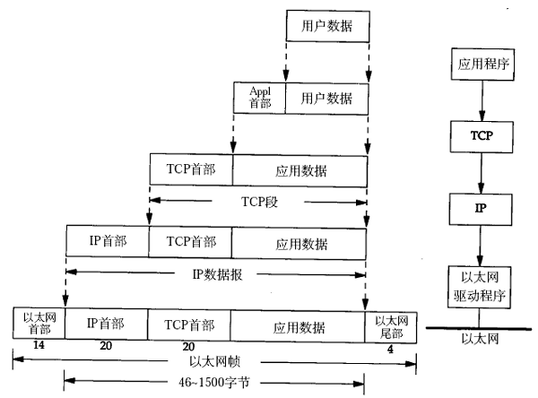
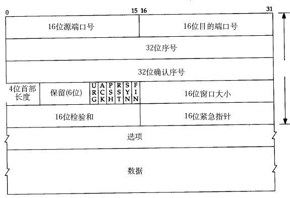
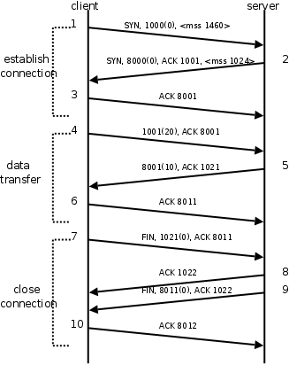

# 第 36 章 TCP/IP 协议基础

## 1. TCP/IP 协议栈与数据包封装

TCP/IP 网络协议栈分为应用层（Application）、传输层（Transport）、网络层（Network）和链路层（Link）四层。如下图所示（该图出自 *TCPIP*）。

<p id="c36-1">图 36.1. TCP/IP 协议栈</p>


两台计算机通过 TCP/IP 协议通讯的过程如下所示（该图出自 *TCPIP*）。

<p id="c36-2">图 36.2. TCP/IP 通讯过程</p>


传输层及其以下的机制由内核提供，应用层由用户进程提供（后面将介绍如何使用 socket API 编写应用程序），应用程序对通讯数据的含义进行解释，而传输层及其以下处理通讯的细节，将数据从一台计算机通过一定的路径发送到另一台计算机。应用层数据通过协议栈发到网络上时，每层协议都要加上一个数据首部（header），称为封装（Encapsulation），如下图所示（该图出自 *TCPIP*）。

<p id="c36-3">图 36.3. TCP/IP 数据包的封装</p>



不同的协议层对数据包有不同的称谓，在传输层叫做段（segment），在网络层叫做数据报（datagram），在链路层叫做帧（frame）。数据封装成帧后发到传输介质上，到达目的主机后每层协议再剥掉相应的首部，最后将应用层数据交给应用程序处理。

上图对应两台计算机在同一网段中的情况，如果两台计算机在不同的网段中，那么数据从一台计算机到另一台计算机传输过程中要经过一个或多个路由器，如下图所示（该图出自 *TCPIP*）。

<p id="c36-4">图 36.4. 跨路由器通讯过程</p>


其实在链路层之下还有物理层，指的是电信号的传递方式，比如现在以太网通用的网线（双绞线）、早期以太网采用的的同轴电缆（现在主要用于有线电视）、光纤等都属于物理层的概念。物理层的能力决定了最大传输速率、传输距离、抗干扰性等。集线器（Hub）是工作在物理层的网络设备，用于双绞线的连接和信号中继（将已衰减的信号再次放大使之传得更远）。

链路层有以太网、令牌环网等标准，链路层负责网卡设备的驱动、帧同步（就是说从网线上检测到什么信号算作新帧的开始）、冲突检测（如果检测到冲突就自动重发）、数据差错校验等工作。交换机是工作在链路层的网络设备，可以在不同的链路层网络之间转发数据帧（比如十兆以太网和百兆以太网之间、以太网和令牌环网之间），由于不同链路层的帧格式不同，交换机要将进来的数据包拆掉链路层首部重新封装之后再转发。

网络层的 IP 协议是构成 Internet 的基础。Internet 上的主机通过IP地址来标识，Internet 上有大量路由器负责根据 IP 地址选择合适的路径转发数据包，数据包从 Internet 上的源主机到目的主机往往要经过十多个路由器。路由器是工作在第三层的网络设备，同时兼有交换机的功能，可以在不同的链路层接口之间转发数据包，因此路由器需要将进来的数据包拆掉网络层和链路层两层首部并重新封装。IP 协议不保证传输的可靠性，数据包在传输过程中可能丢失，可靠性可以在上层协议或应用程序中提供支持。

网络层负责点到点（point-to-point）的传输（这里的「点」指主机或路由器），而传输层负责端到端（end-to-end）的传输（这里的「端」指源主机和目的主机）。传输层可选择 TCP 或 UDP 协议。TCP 是一种面向连接的、可靠的协议，有点像打电话，双方拿起电话互通身份之后就建立了连接，然后说话就行了，这边说的话那边保证听得到，并且是按说话的顺序听到的，说完话挂机断开连接。也就是说 TCP 传输的双方需要首先建立连接，之后由 TCP 协议保证数据收发的可靠性，丢失的数据包自动重发，上层应用程序收到的总是可靠的数据流，通讯之后关闭连接。UDP 协议不面向连接，也不保证可靠性，有点像寄信，写好信放到邮筒里，既不能保证信件在邮递过程中不会丢失，也不能保证信件是按顺序寄到目的地的。使用 UDP 协议的应用程序需要自己完成丢包重发、消息排序等工作。

目的主机收到数据包后，如何经过各层协议栈最后到达应用程序呢？整个过程如下图所示（该图出自 *TCPIP*）。

<p id="c36-5">图 36.5. Multiplexing 过程</p>


以太网驱动程序首先根据以太网首部中的「上层协议」字段确定该数据帧的有效载荷（payload，指除去协议首部之外实际传输的数据）是 IP、ARP 还是 RARP 协议的数据报，然后交给相应的协议处理。假如是 IP 数据报，IP 协议再根据 IP 首部中的「上层协议」字段确定该数据报的有效载荷是 TCP、UDP、ICMP 还是 IGMP，然后交给相应的协议处理。假如是 TCP 段或 UDP 段，TCP 或 UDP 协议再根据 TCP 首部或 UDP 首部的「端口号」字段确定应该将应用层数据交给哪个用户进程。IP 地址是标识网络中不同主机的地址，而端口号就是同一台主机上标识不同进程的地址，IP 地址和端口号合起来标识网络中唯一的进程。

注意，虽然 IP、ARP 和 RARP 数据报都需要以太网驱动程序来封装成帧，但是从功能上划分，ARP 和 RARP 属于链路层，IP 属于网络层。虽然 ICMP、IGMP、TCP、UDP 的数据都需要 IP 协议来封装成数据报，但是从功能上划分，ICMP、IGMP 与 IP 同属于网络层，TCP 和 UDP 属于传输层。本文对 RARP、ICMP、IGMP 协议不做进一步介绍，有兴趣的读者可以看参考资料。

## 2. 以太网(RFC 894)帧格式

以太网的帧格式如下所示（该图出自 *TCPIP*）：

<p id="c36-6">图 36.6. 以太网帧格式</p>


其中的源地址和目的地址是指网卡的硬件地址（也叫 MAC 地址），长度是 48 位，是在网卡出厂时固化的。用 ifconfig 命令看一下，「HWaddr  00:15:F2:14:9E:3F」部分就是硬件地址。协议字段有三种值，分别对应 IP、ARP、RARP。帧末尾是 CRC 校验码。

以太网帧中的数据长度规定最小 46 字节，最大 1500 字节，ARP 和 RARP 数据包的长度不够 46 字节，要在后面补填充位。最大值 1500 称为以太网的最大传输单元（MTU），不同的网络类型有不同的 MTU，如果一个数据包从以太网路由到拨号链路上，数据包长度大于拨号链路的 MTU 了，则需要对数据包进行分片（fragmentation）。ifconfig 命令的输出中也有「MTU:1500」。注意，MTU 这个概念指数据帧中有效载荷的最大长度，不包括帧首部的长度。

## 3. ARP 数据报格式

在网络通讯时，源主机的应用程序知道目的主机的 IP 地址和端口号，却不知道目的主机的硬件地址，而数据包首先是被网卡接收到再去处理上层协议的，如果接收到的数据包的硬件地址与本机不符，则直接丢弃。因此在通讯前必须获得目的主机的硬件地址。ARP 协议就起到这个作用。源主机发出 ARP 请求，询问「IP 地址是 192.168.0.1 的主机的硬件地址是多少」，并将这个请求广播到本地网段（以太网帧首部的硬件地址填 FF:FF:FF:FF:FF:FF 表示广播），目的主机接收到广播的 ARP 请求，发现其中的 IP 地址与本机相符，则发送一个 ARP 应答数据包给源主机，将自己的硬件地址填写在应答包中。

每台主机都维护一个 ARP 缓存表，可以用 arp -a 命令查看。缓存表中的表项有过期时间（一般为 20 分钟），如果 20 分钟内没有再次使用某个表项，则该表项失效，下次还要发 ARP 请求来获得目的主机的硬件地址。想一想，为什么表项要有过期时间而不是一直有效？

ARP 数据报的格式如下所示（该图出自 *TCPIP*）：

<p id="c36-7">图 36.7. ARP 数据报格式</p>


注意到源 MAC 地址、目的 MAC 地址在以太网首部和 ARP 请求中各出现一次，对于链路层为以太网的情况是多余的，但如果链路层是其它类型的网络则有可能是必要的。硬件类型指链路层网络类型，1 为以太网，协议类型指要转换的地址类型，0x0800 为 IP 地址，后面两个地址长度对于以太网地址和 IP 地址分别为 6 和 4（字节），op 字段为 1 表示 ARP 请求，op 字段为 2 表示 ARP 应答。

下面举一个具体的例子。

请求帧如下（为了清晰在每行的前面加了字节计数，每行 16 个字节）：

以太网首部（14 字节）
 0000: ff ff ff ff ff ff 00 05 5d 61 58 a8 08 06
 ARP帧（28 字节）
 0000:                                           00 01
 0010: 08 00 06 04 00 01 00 05 5d 61 58 a8 c0 a8 00 37
 0020: 00 00 00 00 00 00 c0 a8 00 02
 填充位（18 字节）
 0020:                               00 77 31 d2 50 10
 0030: fd 78 41 d3 00 00 00 00 00 00 00 00

以太网首部：目的主机采用广播地址，源主机的 MAC 地址是 00:05:5d:61:58:a8，上层协议类型 0x0806 表示 ARP。

ARP 帧：硬件类型 0x0001 表示以太网，协议类型 0x0800 表示 IP 协议，硬件地址（MAC 地址）长度为 6，协议地址（IP 地址）长度为 4，op 为 0x0001 表示请求目的主机的 MAC 地址，源主机 MAC 地址为 00:05:5d:61:58:a8，源主机 IP 地址为 c0  a8 00 37（192.168.0.55），目的主机 MAC地址全 0 待填写，目的主机 IP 地址为 c0 a8 00  02（192.168.0.2）。

由于以太网规定最小数据长度为 46 字节，ARP 帧长度只有 28 字节，因此有 18 字节填充位，填充位的内容没有定义，与具体实现相关。

应答帧如下：

```
以太网首部
 0000: 00 05 5d 61 58 a8 00 05 5d a1 b8 40 08 06
 ARP 帧
 0000:                                           00 01
 0010: 08 00 06 04 00 02 00 05 5d a1 b8 40 c0 a8 00 02
 0020: 00 05 5d 61 58 a8 c0 a8 00 37
 填充位
 0020:                               00 77 31 d2 50 10
 0030: fd 78 41 d3 00 00 00 00 00 00 00 00
```

以太网首部：目的主机的 MAC 地址是 00:05:5d:61:58:a8，源主机的 MAC 地址是 00:05:5d:a1:b8:40，上层协议类型 0x0806 表示 ARP。

ARP 帧：硬件类型 0x0001 表示以太网，协议类型 0x0800 表示 IP 协议，硬件地址（MAC 地址）长度为 6，协议地址（IP 地址）长度为 4，op 为 0x0002 表示应答，源主机 MAC 地址为 00:05:5d:a1:b8:40，源主机 IP 地址为 c0  a8 00 02（192.168.0.2），目的主机 MAC 地址为 00:05:5d:61:58:a8，目的主机 IP 地址为 c0 a8 00  37（192.168.0.55）。

### 思考题

如果源主机和目的主机不在同一网段，ARP 请求的广播帧无法穿过路由器，源主机如何与目的主机通信？

## 4. IP 数据报格式

IP 数据报的格式如下（这里只讨论 IPv4）（该图出自 *TCPIP*）：

<p id="c36-8">图 36.8. IP 数据报格式</p>


IP 数据报的首部长度和数据长度都是可变长的，但总是 4 字节的整数倍。对于 IPv4，4 位版本字段是 4。4 位首部长度的数值是以 4 字节为单位的，最小值为 5，也就是说首部长度最小是 4x5=20 字节，也就是不带任何选项的 IP 首部，4 位能表示的最大值是 15，也就是说首部长度最大是 60 字节。8 位 TOS 字段有 3 个位用来指定 IP 数据报的优先级（目前已经废弃不用），还有 4 个位表示可选的服务类型（最小延迟、最大呑吐量、最大可靠性、最小成本），还有一个位总是 0。总长度是整个数据报（包括 IP 首部和 IP 层 payload）的字节数。每传一个 IP 数据报，16 位的标识加 1，可用于分片和重新组装数据报。3 位标志和 13 位片偏移用于分片。TTL（Time  to  live）是这样用的：源主机为数据包设定一个生存时间，比如 64，每过一个路由器就把该值减 1，如果减到 0 就表示路由已经太长了仍然找不到目的主机的网络，就丢弃该包，因此这个生存时间的单位不是秒，而是跳（hop）。协议字段指示上层协议是 TCP、UDP、ICMP 还是 IGMP。然后是校验和，只校验 IP 首部，数据的校验由更高层协议负责。IPv4 的 IP 地址长度为 32 位。选项字段的解释从略。

想一想，前面讲了以太网帧中的最小数据长度为 46 字节，不足 46 字节的要用填充字节补上，那么如何界定这 46 字节里前多少个字节是 IP、ARP 或 RARP 数据报而后面是填充字节？

## 5. IP 地址与路由

IPv4 的 IP 地址长度为 4 字节，通常采用点分十进制表示法（dotted  decimal  representation）例如 0xc0a80002 表示为 192.168.0.2。Internet 被各种路由器和网关设备分隔成很多网段，为了标识不同的网段，需要把 32 位的 IP 地址划分成网络号和主机号两部分，网络号相同的各主机位于同一网段，相互间可以直接通信，网络号不同的主机之间通信则需要通过路由器转发。

过去曾经提出一种划分网络号和主机号的方案，把所有 IP 地址分为五类，如下图所示（该图出自 *TCPIP*）。

<p id="c36-9">图 36.9. IP 地址类</p>


|类别|起始|结束|
|------|---------|---------|
|B类 |  128.0.0.0 | 191.255.255.255|
|C类 |  192.0.0.0 | 223.255.255.255|
|D类 |  224.0.0.0 | 239.255.255.255|
|E类 |  240.0.0.0 | 247.255.255.255|

一个 A 类网络可容纳的地址数量最大，一个 B 类网络的地址数量是 65536，一个 C 类网络的地址数量是 256。D 类地址用作多播地址，E 类地址保留未用。

随着 Internet 的飞速发展，这种划分方案的局限性很快显现出来，大多数组织都申请 B 类网络地址，导致 B 类地址很快就分配完了，而 A 类却浪费了大量地址。这种方式对网络的划分是 flat 的而不是层级结构（hierarchical）的，Internet 上的每个路由器都必须掌握所有网络的信息，随着大量 C 类网络的出现，路由器需要检索的路由表越来越庞大，负担越来越重。

针对这种情况提出了新的划分方案，称为 CIDR（Classless  Interdomain Routing）。网络号和主机号的划分需要用一个额外的子网掩码（subnet  mask）来表示，而不能由IP地址本身的数值决定，也就是说，网络号和主机号的划分与这个 IP 地址是 A 类、B 类还是 C 类无关，因此称为 Classless 的。这样，多个子网就可以汇总（summarize）成一个 Internet 上的网络，例如，有 8 个站点都申请了 C 类网络，本来网络号是 24 位的，但是这 8 个站点通过同一个 ISP（Internet service provider）连到 Internet 上，它们网络号的高 21 位是相同的，只有低三位不同，这 8 个站点就可以汇总，在 Internet 上只需要一个路由表项，数据包通过 Internet 上的路由器到达 ISP，然后在 ISP 这边再通过次级的路由器选路到某个站点。

下面举两个例子：

<p id="t36-1">表 36.1. 划分子网的例子 1</p>

| IP 地址       | 140.252.20.68               | 8C FC 14 44 |
| ------------ | --------------------------- | ----------- |
| 子网掩码     | 255.255.255.0               | FF FF FF 00 |
| 网络号       | 140.252.20.0                | 8C FC 14 00 |
| 子网地址范围 | 140.252.20.0~140.252.20.255 |             |

<p id="t36-1">表 36.2. 划分子网的例子 2</p>

| IP 地址       | 140.252.20.68               | 8C FC 14 44 |
| ------------ | --------------------------- | ----------- |
| 子网掩码     | 255.255.255.240             | FF FF FF F0 |
| 网络号       | 140.252.20.64               | 8C FC 14 40 |
| 子网地址范围 | 140.252.20.64~140.252.20.79 |             |

可见，IP 地址与子网掩码做与运算可以得到网络号，主机号从全 0 到全 1 就是子网的地址范围。IP 地址和子网掩码还有一种更简洁的表示方法，例如 140.252.20.68/24，表示 IP 地址为 140.252.20.68，子网掩码的高 24 位是 1，也就是 255.255.255.0。

如果一个组织内部组建局域网，IP 地址只用于局域网内的通信，而不直接连到 Internet 上，理论上使用任意的 IP 地址都可以，但是 RFC 1918 规定了用于组建局域网的私有 IP 地址，这些地址不会出现在 Internet 上，如下表所示。

- `10.*`，前 8 位是网络号，共 16,777,216 个地址
- `172.16.*` 到 `172.31.*`，前 12 位是网络号，共 1,048,576 个地址
- `192.168.*`，前 16 位是网络号，共 65,536 个地址

使用私有 IP 地址的局域网主机虽然没有 Internet 的 IP 地址，但也可以通过代理服务器或 NAT（网络地址转换）等技术连到 Internet 上。

除了私有 IP 地址之外，还有几种特殊的 IP 地址。`127.*` 的 IP 地址用于本机环回（loop back）测试，通常是 127.0.0.1。loopback 是系统中一种特殊的网络设备，如果发送数据包的目的地址是环回地址，或者与本机其它网络设备的 IP 地址相同，则数据包不会发送到网络介质上，而是通过环回设备再发回给上层协议和应用程序，主要用于测试。如下图所示（该图出自 *TCPIP*）。

<p id="c36-10">图 36.10. loopback 设备</p>


还有一些不能用作主机 IP 地址的特殊地址：

- 目的地址为 255.255.255.255，表示本网络内部广播，路由器不转发这样的广播数据包。
- 主机号全为 0 的地址只表示网络而不能表示某个主机，如 192.168.10.0（假设子网掩码为 255.255.255.0）。
- 目的地址的主机号为全 1，表示广播至某个网络的所有主机，例如目的地址 192.168.10.255 表示广播至 192.168.10.0 网络（假设子网掩码为 255.255.255.0）。

下面介绍路由的过程，首先正式定义几个名词：

- 路由（名词）：数据包从源地址到目的地址所经过的路径，由一系列路由节点组成。
- 路由（动词）：某个路由节点为数据报选择投递方向的选路过程。
- 路由节点：一个具有路由能力的主机或路由器，它维护一张路由表，通过查询路由表来决定向哪个接口发送数据包。
- 接口：路由节点与某个网络相连的网卡接口。
- 路由表：由很多路由条目组成，每个条目都指明去往某个网络的数据包应该经由哪个接口发送，其中最后一条是缺省路由条目。
- 路由条目：路由表中的一行，每个条目主要由目的网络地址、子网掩码、下一跳地址、发送接口四部分组成，如果要发送的数据包的目的网络地址匹配路由表中的某一行，就按规定的接口发送到下一跳地址。
- 缺省路由条目：路由表中的最后一行，主要由下一跳地址和发送接口两部分组成，当目的地址与路由表中其它行都不匹配时，就按缺省路由条目规定的接口发送到下一跳地址。

假设某主机上的网络接口配置和路由表如下：

```bash
$ ifconfig
eth0      Link encap:Ethernet  HWaddr 00:0C:29:C2:8D:7E
          inet addr:192.168.10.223  Bcast:192.168.10.255  Mask:255.255.255.0
          UP BROADCAST RUNNING MULTICAST  MTU:1500  Metric:1
          RX packets:0 errors:0 dropped:0 overruns:0 frame:0
          TX packets:10 errors:0 dropped:0 overruns:0 carrier:0
          collisions:0 txqueuelen:100
          RX bytes:0 (0.0 b)  TX bytes:420 (420.0 b)
          Interrupt:10 Base address:0x10a0

eth1      Link encap:Ethernet  HWaddr 00:0C:29:C2:8D:88
          inet addr:192.168.56.136  Bcast:192.168.56.255  Mask:255.255.255.0
          UP BROADCAST RUNNING MULTICAST  MTU:1500  Metric:1
          RX packets:603 errors:0 dropped:0 overruns:0 frame:0
          TX packets:110 errors:0 dropped:0 overruns:0 carrier:0
          collisions:0 txqueuelen:100
          RX bytes:55551 (54.2 Kb)  TX bytes:7601 (7.4 Kb)
          Interrupt:9 Base address:0x10c0

lo        Link encap:Local Loopback  
          inet addr:127.0.0.1  Mask:255.0.0.0
          UP LOOPBACK RUNNING  MTU:16436  Metric:1
          RX packets:37 errors:0 dropped:0 overruns:0 frame:0
          TX packets:37 errors:0 dropped:0 overruns:0 carrier:0
          collisions:0 txqueuelen:0 
          RX bytes:3020 (2.9 Kb)  TX bytes:3020 (2.9 Kb)
$ route
Kernel IP routing table
Destination     Gateway         Genmask         Flags Metric Ref    Use Iface
192.168.10.0    *               255.255.255.0   U     0      0        0 eth0
192.168.56.0    *               255.255.255.0   U     0      0        0 eth1
127.0.0.0       *               255.0.0.0       U     0      0        0 lo
default         192.168.10.1    0.0.0.0         UG    0      0        0 eth0
```

这台主机有两个网络接口，一个网络接口连到 192.168.10.0/24 网络，另一个网络接口连到 192.168.56.0/24 网络。路由表的 Destination 是目的网络地址，Genmask 是子网掩码，Gateway 是下一跳地址，Iface 是发送接口，Flags 中的 U 标志表示此条目有效（可以禁用某些条目），G 标志表示此条目的下一跳地址是某个路由器的地址，没有 G 标志的条目表示目的网络地址是与本机接口直接相连的网络，不必经路由器转发，因此下一跳地址处记为 `*` 号。

如果要发送的数据包的目的地址是 192.168.56.3，跟第一行的子网掩码做与运算得到 192.168.56.0，与第一行的目的网络地址不符，再跟第二行的子网掩码做与运算得到 192.168.56.0，正是第二行的目的网络地址，因此从 eth1 接口发送出去，由于 192.168.56.0/24 正是与 eth1 接口直接相连的网络，因此可以直接发到目的主机，不需要经路由器转发。

如果要发送的数据包的目的地址是 202.10.1.2，跟前三行路由表条目都不匹配，那么就要按缺省路由条目，从 eth0 接口发出去，首先发往 192.168.10.1 路由器，再让路由器根据它的路由表决定下一跳地址。

## 6. UDP 段格式

下图是 UDP 的段格式（该图出自 *TCPIP*）。

<p id="c36-11">图 36.11. UDP 段格式</p>


下面分析一帧基于 UDP 的 TFTP 协议帧。

```
以太网首部
 0000: 00 05 5d 67 d0 b1 00 05 5d 61 58 a8 08 00 
 IP首部
 0000:                                           45 00
 0010: 00 53 93 25 00 00 80 11 25 ec c0 a8 00 37 c0 a8
 0020: 00 01
 UDP首部
 0020：      05 d4 00 45 00 3f ac 40
 TFTP协议
 0020:                               00 01 'c'':''\''q'
 0030: 'w''e''r''q''.''q''w''e'00 'n''e''t''a''s''c''i'
 0040: 'i'00 'b''l''k''s''i''z''e'00 '5''1''2'00 't''i'
 0050: 'm''e''o''u''t'00 '1''0'00 't''s''i''z''e'00 '0'
 0060: 00
```

以太网首部：源 MAC 地址是 00:05:5d:61:58:a8，目的 MAC 地址是 00:05:5d:67:d0:b1，上层协议类型 0x0800 表示 IP。

IP 首部：每一个字节 0x45 包含 4 位版本号和 4 位首部长度，版本号为 4，即 IPv4，首部长度为 5，说明 IP 首部不带有选项字段。服务类型为 0，没有使用服务。16 位总长度字段（包括 IP 首部和 IP 层 payload 的长度）为 0x0053，即 83 字节，加上以太网首部 14 字节可知整个帧长度是 97 字节。IP 报标识是 0x9325，标志字段和片偏移字段设置为 0x0000，就是 DF=0 允许分片，MF=0 此数据报没有更多分片，没有分片偏移。TTL 是 0x80，也就是 128。上层协议 0x11 表示 UDP 协议。IP 首部校验和为 0x25ec，源主机 IP 是 c0  a8 00 37（192.168.0.55），目的主机 IP 是 c0 a8 00 01（192.168.0.1）。

UDP 首部：源端口号 0x05d4（1492）是客户端的端口号，目的端口号 0x0045（69）是 TFTP 服务的 well-known 端口号。UDP 报长度为 0x003f，即 63 字节，包括 UDP 首部和 UDP 层 payload 的长度。UDP 首部和 UDP 层 payload 的校验和为 0xac40。

TFTP 是基于文本的协议，各字段之间用字节 0 分隔，开头的 00 01 表示请求读取一个文件，接下来的各字段是：

```
c:\qwerq.qwe
 netascii
 blksize 512
 timeout 10
 tsize 0
```

一般的网络通信都是像 TFTP 协议这样，通信的双方分别是客户端和服务器，客户端主动发起请求（上面的例子就是客户端发起的请求帧），而服务器被动地等待、接收和应答请求。客户端的 IP 地址和端口号唯一标识了该主机上的 TFTP 客户端进程，服务器的 IP 地址和端口号唯一标识了该主机上的 TFTP 服务进程，由于客户端是主动发起请求的一方，它必须知道服务器的 IP 地址和 TFTP 服务进程的端口号，所以，一些常见的网络协议有默认的服务器端口，例如 HTTP 服务默认 TCP 协议的 80 端口，FTP 服务默认 TCP 协议的 21 端口，TFTP 服务默认 UDP 协议的 69 端口（如上例所示）。在使用客户端程序时，必须指定服务器的主机名或 IP 地址，如果不明确指定端口号则采用默认端口，请读者查阅 ftp、tftp 等程序的 man page 了解如何指定端口号。/etc/services 中列出了所有 well-known 的服务端口和对应的传输层协议，这是由 IANA（Internet Assigned Numbers Authority）规定的，其中有些服务既可以用 TCP 也可以用 UDP，为了清晰，IANA 规定这样的服务采用相同的 TCP 或 UDP 默认端口号，而另外一些 TCP 和 UDP 的相同端口号却对应不同的服务。

很多服务有 well-known 的端口号，然而客户端程序的端口号却不必是 well-known 的，往往是每次运行客户端程序时由系统自动分配一个空闲的端口号，用完就释放掉，称为 ephemeral 的端口号，想想这是为什么。

前面提过，UDP 协议不面向连接，也不保证传输的可靠性，例如：

- 发送端的 UDP 协议层只管把应用层传来的数据封装成段交给 IP 协议层就算完成任务了，如果因为网络故障该段无法发到对方，UDP 协议层也不会给应用层返回任何错误信息。
- 接收端的 UDP 协议层只管把收到的数据根据端口号交给相应的应用程序就算完成任务了，如果发送端发来多个数据包并且在网络上经过不同的路由，到达接收端时顺序已经错乱了，UDP 协议层也不保证按发送时的顺序交给应用层。
- 通常接收端的 UDP 协议层将收到的数据放在一个固定大小的缓冲区中等待应用程序来提取和处理，如果应用程序提取和处理的速度很慢，而发送端发送的速度很快，就会丢失数据包，UDP 协议层并不报告这种错误。

因此，使用 UDP 协议的应用程序必须考虑到这些可能的问题并实现适当的解决方案，例如等待应答、超时重发、为数据包编号、流量控制等。一般使用 UDP 协议的应用程序实现都比较简单，只是发送一些对可靠性要求不高的消息，而不发送大量的数据。例如，基于 UDP 的 TFTP 协议一般只用于传送小文件（所以才叫 trivial 的 ftp），而基于 TCP 的 FTP 协议适用于各种文件的传输。下面看 TCP 协议如何用面向连接的服务来代替应用程序解决传输的可靠性问题。

## 7. TCP协议

### 7.1. 段格式

TCP 的段格式如下图所示（该图出自 *TCPIP*）。

<p id="c36-12">图 36.12. TCP 段格式</p>



和 UDP 协议一样也有源端口号和目的端口号，通讯的双方由 IP 地址和端口号标识。32 位序号、32 位确认序号、窗口大小稍后详细解释。4 位首部长度和 IP 协议头类似，表示 TCP 协议头的长度，以 4 字节为单位，因此 TCP 协议头最长可以是 4x15=60 字节，如果没有选项字段，TCP 协议头最短 20 字节。URG、ACK、PSH、RST、SYN、FIN 是六个控制位，本节稍后将解释 SYN、ACK、FIN、RST 四个位，其它位的解释从略。16 位检验和将 TCP 协议头和数据都计算在内。紧急指针和各种选项的解释从略。

### 7.2. 通讯时序

下图是一次 TCP 通讯的时序图。

<p id="c36-13">图 36.13. TCP 连接建立断开</p>



在这个例子中，首先客户端主动发起连接、发送请求，然后服务器端响应请求，然后客户端主动关闭连接。两条竖线表示通讯的两端，从上到下表示时间的先后顺序，注意，数据从一端传到网络的另一端也需要时间，所以图中的箭头都是斜的。双方发送的段按时间顺序编号为 1-10，各段中的主要信息在箭头上标出，例如段 2 的箭头上标着 SYN,  8000(0), ACK 1001, <mss  1024>，表示该段中的 SYN 位置 1，32 位序号是 8000，该段不携带有效载荷（数据字节数为 0），ACK 位置 1，32 位确认序号是 1001，带有一个 mss 选项值为 1024。

建立连接的过程：

1. 客户端发出段 1，SYN 位表示连接请求。序号是 1000，这个序号在网络通讯中用作临时的地址，每发一个数据字节，这个序号要加 1，这样在接收端可以根据序号排出数据包的正确顺序，也可以发现丢包的情况，另外，规定 SYN 位和 FIN 位也要占一个序号，这次虽然没发数据，但是由于发了 SYN 位，因此下次再发送应该用序号 1001。mss 表示最大段尺寸，如果一个段太大，封装成帧后超过了链路层的最大帧长度，就必须在 IP 层分片，为了避免这种情况，客户端声明自己的最大段尺寸，建议服务器端发来的段不要超过这个长度。
2. 服务器发出段 2，也带有 SYN 位，同时置 ACK 位表示确认，确认序号是 1001，表示「我接收到序号 1000 及其以前所有的段，请你下次发送序号为 1001 的段」，也就是应答了客户端的连接请求，同时也给客户端发出一个连接请求，同时声明最大尺寸为 1024。
3. 客户端发出段 3，对服务器的连接请求进行应答，确认序号是 8001。

在这个过程中，客户端和服务器分别给对方发了连接请求，也应答了对方的连接请求，其中服务器的请求和应答在一个段中发出，因此一共有三个段用于建立连接，称为「三方握手（three-way-handshake）」。在建立连接的同时，双方协商了一些信息，例如双方发送序号的初始值、最大段尺寸等。

在 TCP 通讯中，如果一方收到另一方发来的段，读出其中的目的端口号，发现本机并没有任何进程使用这个端口，就会应答一个包含 RST 位的段给另一方。例如，服务器并没有任何进程使用 8080 端口，我们却用 telnet 客户端去连接它，服务器收到客户端发来的 SYN 段就会应答一个 RST 段，客户端的 telnet 程序收到 RST 段后报告错误 Connection  refused：

```bash
$ telnet 192.168.0.200 8080
Trying 192.168.0.200...
telnet: Unable to connect to remote host: Connection refused
```

数据传输的过程：

1. 客户端发出段 4，包含从序号 1001 开始的 20 个字节数据。
2. 服务器发出段 5，确认序号为 1021，对序号为 1001-1020 的数据表示确认收到，同时请求发送序号 1021 开始的数据，服务器在应答的同时也向客户端发送从序号 8001 开始的 10 个字节数据，这称为 piggyback。
3. 客户端发出段 6，对服务器发来的序号为 8001-8010 的数据表示确认收到，请求发送序号 8011开始的数据。

在数据传输过程中，ACK 和确认序号是非常重要的，应用程序交给 TCP协议发送的数据会暂存在 TCP 层的发送缓冲区中，发出数据包给对方之后，只有收到对方应答的 ACK 段才知道该数据包确实发到了对方，可以从发送缓冲区中释放掉了，如果因为网络故障丢失了数据包或者丢失了对方发回的 ACK 段，经过等待超时后 TCP 协议自动将发送缓冲区中的数据包重发。

这个例子只描述了最简单的一问一答的情景，实际的 TCP 数据传输过程可以收发很多数据段，虽然典型的情景是客户端主动请求服务器被动应答，但也不是必须如此，事实上 TCP 协议为应用层提供了全双工（full-duplex）的服务，双方都可以**主动甚至同时**给对方发送数据。

如果通讯过程只能采用一问一答的方式，收和发两个方向不能同时传输，在同一时间只允许一个方向的数据传输，则称为半双工（half-duplex），假设某种面向连接的协议是半双工的，则只需要一套序号就够了，不需要通讯双方各自维护一套序号，想一想为什么。

关闭连接的过程：

1. 客户端发出段 7，FIN 位表示关闭连接的请求。
2. 服务器发出段 8，应答客户端的关闭连接请求。
3. 服务器发出段 9，其中也包含 FIN 位，向客户端发送关闭连接请求。
4. 客户端发出段 10，应答服务器的关闭连接请求。

建立连接的过程是三方握手，而关闭连接通常需要 4 个段，服务器的应答和关闭连接请求通常不合并在一个段中，因为有连接半关闭的情况，这种情况下客户端关闭连接之后就不能再发送数据给服务器了，但是服务器还可以发送数据给客户端，直到服务器也关闭连接为止，稍后会看到这样的例子。

### 7.3. 流量控制

介绍 UDP 时我们描述了这样的问题：如果发送端发送的速度较快，接收端接收到数据后处理的速度较慢，而接收缓冲区的大小是固定的，就会丢失数据。TCP 协议通过滑动窗口（Sliding Window）机制解决这一问题。看下图的通讯过程。

<p id="c36-14">图 36.14. 滑动窗口</p>


1. 发送端发起连接，声明最大段尺寸是 1460，初始序号是 0，窗口大小是 4K，表示「我的接收缓冲区还有 4K 字节空闲，你发的数据不要超过 4K」。接收端应答连接请求，声明最大段尺寸是 1024，初始序号是 8000，窗口大小是 6K。发送端应答，三方握手结束。
2. 发送端发出段 4-9，每个段带 1K 的数据，发送端根据窗口大小知道接收端的缓冲区满了，因此停止发送数据。
3. 接收端的应用程序提走2K数据，接收缓冲区又有了 2K 空闲，接收端发出段 10，在应答已收到 6K 数据的同时声明窗口大小为 2K。
4. 接收端的应用程序又提走 2K 数据，接收缓冲区有 4K 空闲，接收端发出段 11，重新声明窗口大小为 4K。
5. 发送端发出段 12-13，每个段带 2K 数据，段 13 同时还包含 FIN 位。
6. 接收端应答接收到的 2K 数据（6145-8192），再加上 FIN 位占一个序号 8193，因此应答序号是 8194，连接处于半关闭状态，接收端同时声明窗口大小为 2K。
7. 接收端的应用程序提走 2K 数据，接收端重新声明窗口大小为 4K。
8. 接收端的应用程序提走剩下的 2K 数据，接收缓冲区全空，接收端重新声明窗口大小为 6K。
9. 接收端的应用程序在提走全部数据后，决定关闭连接，发出段 17 包含 FIN 位，发送端应答，连接完全关闭。

上图在接收端用小方块表示 1K 数据，实心的小方块表示已接收到的数据，虚线框表示接收缓冲区，因此套在虚线框中的空心小方块表示窗口大小，从图中可以看出，随着应用程序提走数据，虚线框是向右滑动的，因此称为滑动窗口。

从这个例子还可以看出，发送端是 1K 1K 地发送数据，而接收端的应用程序可以 2K 2K 地提走数据，当然也有可能一次提走 3K 或 6K 数据，或者一次只提走几个字节的数据，也就是说，应用程序所看到的数据是一个整体，或说是一个流（stream），在底层通讯中这些数据可能被拆成很多数据包来发送，但是一个数据包有多少字节对应用程序是不可见的，因此 TCP 协议是面向流的协议。而 UDP 是面向消息的协议，每个 UDP 段都是一条消息，应用程序必须以消息为单位提取数据，不能一次提取任意字节的数据，这一点和 TCP 是很不同的。